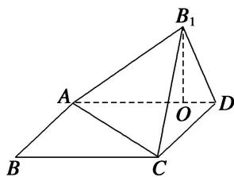

> [!faq]- 《专题10 立体几何中的面积与体积问题-立体几何（文科）》例题解析
>
> > [!success]- **【答案】** 详见解析
>
> > [!note]- **【分析】**
> > 本题未单列分析。
>
> > [!note]- **【解析】**
> > (1)求证：平面 $AB_{1}C \perp$ 平面 $B_{1}CD$ ;
> > (2)求三棱锥 $B_{1}-ABC$ 的体积 $V_{B1-ABC}$ .
> > 
> > 2. 解析
> > (1) $\because B_{1}O \perp$ 平面 $ABCD, CD \subset$ 平面 $ABCD, \therefore B_{1}O \perp CD,$ 又 $CD \perp AD, AD \cap B_{1}O = O, \therefore CD \perp$ 平面 $AB_{1}D,$ 又 $AB_{1} \subset$ 平面 $AB_{1}D, \therefore AB_{1} \perp CD,$ 又 $AB_{1} \perp B_{1}C,$ 且 $B_{1}C \cap CD = C, \therefore AB_{1} \perp$ 平面 $B_{1}CD,$ 又 $AB_{1} \subset$ 平面 $AB_{1}C, \therefore$ 平面 $AB_{1}C \perp$ 平面 $B_{1}CD.$
> > (2)由于 $AB_{1} \perp$ 平面 $B_{1}CD, B_{1}D \subset$ 平面 $ABCD,$ 所以 $AB_{1} \perp B_{1}D,$ 在 Rt $\triangle AB_{1}D$ 中， $B_{1}D = \sqrt{AD^{2} - AB_{1}^{2}} = \sqrt{2}$ ，又由 $B_{1}O \cdot AD = AB_{1} \cdot B_{1}D$ 得 $B_{1}O = \frac{AB_{1} \cdot B_{1}D}{AD} = \frac{\sqrt{6}}{3},$ 所以 $V_{B_{1}-ABC} = \frac{1}{3} S_{\triangle ABC} \cdot B_{1}O = \frac{1}{3} \times \frac{1}{2} \times 1 \times \sqrt{3} \times \frac{\sqrt{6}}{3} = \frac{\sqrt{2}}{6}$ .
