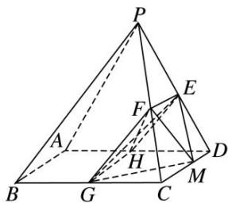

> [!faq]- 《专题10 立体几何中的面积与体积问题-立体几何（文科）》例题解析
>
> > [!success]- **【答案】** 详见解析
>
> > [!note]- **【解析】**
> > 解析
> > (1) 因为平面 $PAD \perp$ 平面 $ABCD$ , 平面 $PAD \cap$ 平面 $ABCD = AD$ , $CD \subset$ 平面 $ABCD$ , 且 $CD \perp AD$ , 所以 $CD \perp$ 平面 $PAD$ . 又因为在 $\triangle PCD$ 中, $E$ , $F$ 分别是 $PD$ , $PC$ 的中点, 所以 $EF \parallel CD$ , 所以 $EF \perp$ 平面 $PAD$ . 因为 $EF \subset$ 平面 $EFG$ , 所以平面 $EFG \perp$ 平面 $PAD$ .
> >
> > 
> >
> > (2)因为 $EF \parallel CD$ ， $EF \subset$ 平面 EFG， $CD \notin$ 平面 EFG，所以 $CD \parallel$ 平面 EFG，
> >
> > 因此 CD 上的点 M 到平面 EFG 的距离等于点 D 到平面 EFG 的距离，
> >
> > 所以 $V_{三棱锥 M—EFG}=V_{三棱锥 D—EFG}$ ,
> >
> > 取 AD 的中点 H，连接 GH，EH，FH，则 $EF \parallel GH$ ，
> >
> > 因为 $EF \perp$ 平面 PAD， $EH \subset$ 平面 PAD，所以 $EF \perp EH$ 。于是 $S_{\triangle EFH} = \frac{1}{2} EF \times EH = 2 = S_{\triangle EFG}$ ，
> >
> > 因为平面 $EFG \perp$ 平面 PAD，平面 $EFG \cap$ 平面 PAD = EH，
> >
> > $\triangle EHD$ 是正三角形，所以点 $D$ 到平面 $EFG$ 的距离等于正 $\triangle EHD$ 的高，即为 $\sqrt{3}$ .
> >
> > 所以三棱锥 M—EFG 的体积 $V_{三棱锥 M—EFG}=V_{三棱锥 D—EFG}=\frac{1}{3}\times S_{\triangle EFG}\times\sqrt{3}=\frac{2\sqrt{3}}{3}$ .
