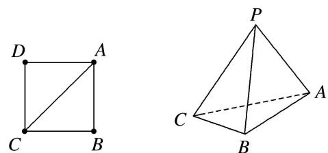
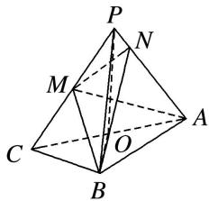

> [!faq]- 《专题10 立体几何中的面积与体积问题-立体几何（文科）》例题解析
>
> > [!success]- **【答案】** 详见解析
>
> > [!note]- **【分析】**
> > 本题未单列分析。
>
> > [!note]- **【解析】**
> > (1)证明：平面 PAC⊥平面 ABC;
> > (2)若 $M$ 是 $PC$ 的中点，设 $\overrightarrow{PN} = \lambda \overrightarrow{PA} (0 < \lambda < 1)$ ，且三棱锥 $A - BMN$ 的体积为 $\frac{8}{9}$ ，求 $\lambda$ 的值.
> > 
> > 5. 解析
> > (1)如图, 取 $AC$ 的中点 $O$ , 连接 $PO$ , $BO$ .
> > 
> > 因为 PC=PA，所以 $PO \perp AC$ .
> > 在 $\triangle POB$ 中， $PO=OB=\frac{1}{2}AC=2$ ， $PB=PA=2\sqrt{2}$ ，则 $PB^{2}=PO^{2}+OB^{2}$ ，所以 $PO\perp OB$ ，又 $AC\cap OB=O$ ，且 $AC$ ， $OB\subset$ 平面 $ABC$ ，所以 $PO\perp$ 平面 $ABC$ ，
> > 又 $PO \subset$ 平面 $PAC$ , 所以平面 $PAC \perp$ 平面 $ABC$ .
> > (2)因为平面 $PAC \perp$ 平面 $ABC$ ，又平面 $PAC \cap$ 平面 $ABC = AC$ ，且 $BO \perp AC$ ，所以 $OB \perp$ 平面 $PAC$ ，所以 $V_{A-BMN} = V_{B-AMN} = \frac{1}{3} S_{\triangle AMN} \cdot BO$ 。又因为 $OB = 2$ ， $V_{A-BMN} = \frac{8}{9}$ ，所以 $S_{\triangle AMN} = \frac{4}{3}$ 。因为 $\overrightarrow{PN} = \lambda \overrightarrow{PA}$ ，所以 $S_{\triangle AMN} = (1 - \lambda) S_{\triangle APM} = \frac{1 - \lambda}{2} S_{\triangle PAC}$ 。又 $S_{\triangle PAC} = \frac{1}{2} PA \cdot PC = 4$ ，所以 $\frac{1 - \lambda}{2} \times 4 = \frac{4}{3}$ ，得 $\lambda = \frac{1}{3}$ 。
> > ## 5. 平行+垂直+体积模型
> > ## 【例题选讲】
