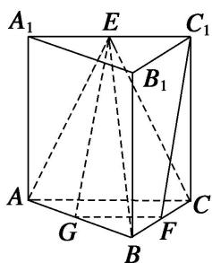

> [!faq]- 《专题10 立体几何中的面积与体积问题-立体几何（文科）》例题解析
>
> > [!success]- **【答案】** B
>
> > [!note]- **【解析】**
> > 解析
> > (1) 在三棱柱 $ABC-A_{1}B_{1}C_{1}$ 中， $BB_{1} \perp$ 底面 ABC，所以 $BB_{1} \perp AB$ .
> >
> > 又因为 $AB \perp BC$ ，所以 $AB \perp$ 平面 $B_{1}BCC_{1}$ ，又 $AB \subset$ 平面 ABE，所以平面 $ABE \perp$ 平面 $B_{1}BCC_{1}$ .
> >
> > 
> >
> > (2)取 $AB$ 的中点 $G$ , 连接 $EG$ , $FG$ . 因为 $E$ , $F$ 分别是 $A_{1}C_{1}$ , $BC$ 的中点,
> >
> > 所以 $FG \parallel AC$ ，且 $FG = \frac{1}{2} AC$ 。因为 $AC \parallel A_{1}C_{1}$ ，且 $AC = A_{1}C_{1}$ ，所以 $FG \parallel EC_{1}$ ，且 $FG = EC_{1}$ ，
> >
> > 所以四边形 $FGEC_{1}$ 为平行四边形．所以 $C_{1}F \parallel EG$ ．又因为 $EG \subset$ 平面 ABE， $C_{1}F \not\subset$ 平面 ABE，
> >
> > 所以 $C_{1}F \parallel$ 平面 ABE.
> >
> > (3)因为 $AA_{1}=AC=2,\quad BC=1,\quad AB\perp BC$ ，所以 $AB=\sqrt{AC^{2}-BC^{2}}=\sqrt{3}$ .
> >
> > 所以三棱锥 E-ABC 的体积 $V=\frac{1}{3}S_{\triangle ABC}\cdot AA_{1}=\frac{1}{3}\times\frac{1}{2}\times\sqrt{3}\times1\times2=\frac{\sqrt{3}}{3}$ .
