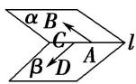
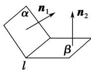
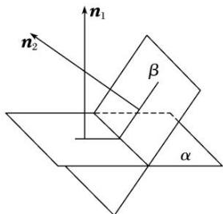

<!-- source-part:1 pages:1-41 -->

## 专题11 利用空间向量计算二面角的问题

## 【方法总结】

## 1. 二面角

(1)如图①，AB，CD 是二面角 $\alpha - l - \beta$ 的两个面内与棱 l 垂直的直线，则二面角的大小 $\theta = <\overrightarrow{AB}, \overrightarrow{CD}>$ .

  
①

  
②

  
③

(2)如图②③， $n_{1}$ ， $n_{2}$ 分别是二面角 $\alpha - l - \beta$ 的两个半平面 $\alpha$ ， $\beta$ 的法向量，则二面角的大小 $\theta$ 满足 $|\cos \theta| = |\cos < n_{1}, n_{2} > |$ ，二面角的平面角大小是向量 $n_{1}$ 与 $n_{2}$ 的夹角（或其补角）.

## 2. 平面与平面的夹角

如图，平面 $\alpha$ 与平面 $\beta$ 相交，形成四个二面角，我们把四个二面角中不大于 $90^{\circ}$ 的二面角称为平面 $\alpha$ 与平面 $\beta$ 的夹角.

若平面 $\alpha$ ， $\beta$ 的法向量分别是 $n_1$ 和 $n_2$ ，则平面 $\alpha$ 与平面 $\beta$ 的夹角即为向量 $n_1$ 和 $n_2$ 的夹角或其补角．设平面 $\alpha$ 与平面 $\beta$ 的夹角为 $\theta$ ，则 $\cos \theta = |\cos < n_1, n_2 > | = \frac{|n_1 \cdot n_2|}{|n_1||n_2|}$

## 3. 利用空间向量计算二面角大小的常用方法

(1)找法向量：分别求出二面角的两个半平面所在平面的法向量，然后通过两个平面的法向量的夹角得到二面角的大小，但要注意结合实际图形判断所求角的大小；

(2)找与棱垂直的方向向量：分别在二面角的两个半平面内找到与棱垂直且以垂足为起点的两个向量，则这两个向量的夹角的大小就是二面角的大小.

## 【例题选讲】

![[高中/总复习/专题/立体几何/专题11 利用空间向量计算2面角的问题-立体几何（理科）/考点01_棱柱_台_模型/考点01_棱柱_台_模型.md]]
![[高中/总复习/专题/立体几何/专题11 利用空间向量计算2面角的问题-立体几何（理科）/考点02_棱_圆_锥模型/考点02_棱_圆_锥模型.md]]
![[高中/总复习/专题/立体几何/专题11 利用空间向量计算2面角的问题-立体几何（理科）/考点03_不规则几何体模型/考点03_不规则几何体模型.md]]
