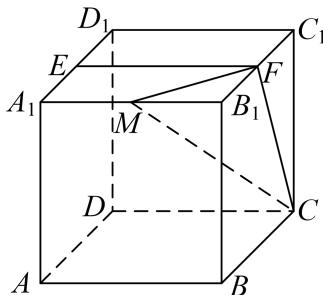

<!-- question-source:start -->
[例 2] (2021·北京)已知正方体 $ABCD-A_{1}B_{1}C_{1}D_{1}$ ，点 E 为 $A_{1}D_{1}$ 中点，直线 $B_{1}C_{1}$ 交平面 CDE 于点 F.
(1)证明：点 F 为 $B_{1}C_{1}$ 的中点；

(2)若点 $M$ 为棱 $A_{1}B_{1}$ 上一点，且二面角 $M - CF - E$ 的余弦值为 $\frac{\sqrt{5}}{3}$ ，求 $\frac{A_1M}{A_1B_1}$ 的值.

<!-- question-source:end -->

![[高中/总复习/专题/立体几何/专题11 利用空间向量计算2面角的问题-立体几何（理科）/考点01_棱柱_台_模型/例题/answers/Q00039820A1.md]]
