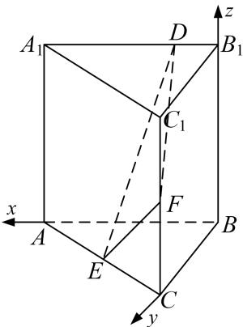

<!-- question-source:start -->
[例 1] (2021·全国甲)已知直三棱柱 $ABC-A_{1}B_{1}C_{1}$ 中，侧面 $AA_{1}B_{1}B$ 为正方形，AB=BC=2，E，F 分别为 AC 和 $CC_{1}$ 的中点，D 为棱 $A_{1}B_{1}$ 上的点， $BF\perp A_{1}B_{1}$ .

(1)证明： $BF \perp DE;$

(2)当 $B_{1}D$ 为何值时，面 $BB_{1}C_{1}C$ 与面 DFE 所成的二面角的正弦值最小？

(1)连接 $AF$ ， $\because E$ ， $F$ 分别为直三棱柱 $ABC - A_1B_1C_1$ 的棱 $AC$ 和 $CC_1$ 的中点，且 $AB = BC = 2$ ， $\therefore CF = 1$ ， $BF = \sqrt{5}$ ， $\because BF \perp A_1B_1$ ， $A_1B_1 // AB$ ， $\therefore BF \perp AB$ ，

$\therefore AF = \sqrt{AB^2 + BF^2} = \sqrt{2^2 + (\sqrt{5})^2} = 3, AC = \sqrt{AF^2 - CF^2} = \sqrt{3^2 - 1^2} = 2\sqrt{2}, \therefore AB^2 + BC^2 = AC^2$ ，即 $BA \perp BC$ . 故以 $B$ 为原点， $BA, BC, BB_1$ 所在直线分别为 $x, y, z$ 轴建立如图所示的空间直角坐标系，则 $A(2, 0, 0), B(0, 0, 0), C(0, 2, 0), E(1, 1, 0), F(0, 2, 1)$ ，设 $B_1D = m$ ，则 $D(m, 0, 2), \therefore \overrightarrow{BF} = (0, 2, 1), \overrightarrow{DE} = (1 - m, 1, -2), \because \overrightarrow{BF} \cdot \overrightarrow{DE} = 0, \therefore BF \perp DE$ .

(2)∵AB⊥平面 $BB_{1}C_{1}C$ ，∴平面 $BB_{1}C_{1}C$ 的一个法向量为 $m=(1,0,0)$ ,

由
(1)知， $\overrightarrow{DE}=(1-m,1,-2)$ ， $\overrightarrow{BF}=(-1,1,1)$ ,

设平面 DFE 的法向量为 $\boldsymbol{n}=(x,y,z)$ ，则有 $\left\{\begin{aligned}\boldsymbol{n}\cdot\overrightarrow{DE}&=0,\\ \boldsymbol{n}\cdot\overrightarrow{EF}&=0,\end{aligned}\right.$ ，即 $\left\{\begin{aligned}(1-m)x+y-2z&=0,\\ -x+y+z&=0.\end{aligned}\right.$

令 x=3，则 $y=m+1,\quad z=2-m$ ，故 $n=(3,\quad m+1,\quad 2-m)$ ,

所以 $\cos < n, m > = \frac{n \cdot m}{|n||m|} = \frac{3}{\sqrt{9 + (m + 1)^2 + (2 - m)^2}} = \frac{3}{\sqrt{2m^2 - 2m + 14}}.$

所以当 $m = \frac{1}{2}$ 时，面 $BB_{1}C_{1}C$ 与面 $DFE$ 所成的二面角的余弦值最大为 $\frac{\sqrt{6}}{3}$ ，此时正弦值最小为 $\frac{\sqrt{3}}{3}$ .
<!-- question-source:end -->

![[高中/总复习/专题/立体几何/专题11 利用空间向量计算2面角的问题-立体几何（理科）/考点01_棱柱_台_模型/例题/answers/Q00043732A1.md]]
