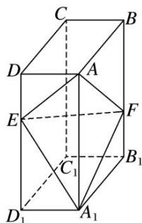

<!-- question-source:start -->
[例 3] (2020·全国Ⅲ改编)如图，在长方体 $ABCD-A_{1}B_{1}C_{1}D_{1}$ 中，点 E，F 分别在棱 $DD_{1}$ ， $BB_{1}$ 上，且 $2DE=ED_{1}$ ， $BF=2FB_{1}$ .

(1)证明：点 $C_1$ 在平面 $AEF$ 内；

(2)若 AB=2, AD=1, $AA_{1}=3$ ，求平面 AEF 与平面 $EFA_{1}$ 夹角的正弦值.

<!-- question-source:end -->

![[高中/总复习/专题/立体几何/专题11 利用空间向量计算2面角的问题-立体几何（理科）/考点01_棱柱_台_模型/例题/answers/Q00043733A1.md]]
