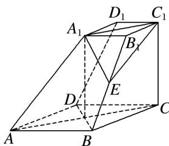

<!-- question-source:start -->
[例 4] 如图，在四棱台 $ABCD-A_{1}B_{1}C_{1}D_{1}$ 中，底面 ABCD 是菱形， $CC_{1}\perp$ 底面 ABCD，且 $\angle BAD=60^{\circ}$ ， $CD=CC_{1}=2C_{1}D_{1}=4$ ，E 是棱 $BB_{1}$ 的中点.

(1)求证： $AA_{1} \perp BD;$

(2)求二面角 $E-A_{1}C_{1}-C$ 的余弦值.

<!-- question-source:end -->

![[高中/总复习/专题/立体几何/专题11 利用空间向量计算2面角的问题-立体几何（理科）/考点01_棱柱_台_模型/例题/answers/Q00043734A1.md]]
