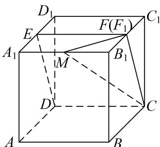
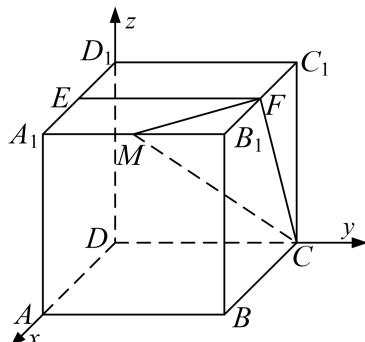

> [!faq]- 《专题11 利用空间向量计算2面角的问题-立体几何（理科）》例题解析
>
> > [!success]- **【答案】** 详见解析
>
> > [!note]- **【解析】**
> > 解析 如图所示，取 $B_{1}C_{1}$ 的中点 $F'$ ，连结 DE， $EF'$ ， $F'C$ ，
> >
> > 由于 $ABCD-A_{1}B_{1}C_{1}D_{1}$ 为正方体，E， $F'$ 为中点，故 $EF' \parallel CD$ ，
> >
> > 从而 E, $F'$ , C, D, 四点共面, 所以平面 CDE 即平面 CDEF',
> >
> > 据此可得，直线 $B_{1}C_{1}$ 交平面 CDE 于点 $F'$ ,
> >
> > 当直线与平面相交时只有唯一的交点，故点 F 与点 $F'$ 重合，即点 F 为 $B_{1}C_{1}$ 中点.
> >
> > 
> >
> > (2)以点 D 为坐标原点，DA，DC， $DD_{1}$ ，方向分别为 x 轴，y 轴，z 轴正方形，建立空间直角坐标系 Dxyz，
> >
> > 
> >
> > 不妨设正方体的棱长为 2，设 $\frac{A_{1}M}{A_{1}B_{1}}=\lambda(0\leq\lambda\leq1)$ ,
> >
> > 则， $M(2, 2\lambda, 2)$ ， $C(0, 2, 0)$ ， $F(1, 2, 2)$ ， $E(1, 0, 2)$ ，
> >
> > 从而， $\overrightarrow{MC}=(-2,2-2\lambda,-2)$ ， $\overrightarrow{CF}=(1,0,2)$ ， $\overrightarrow{FE}=(0,-2,0)$
> >
> > 设平面 MCF 的法向量为 $\boldsymbol{m}=(x_{1},y_{1},z_{1})$ ，所以 $\left\{\begin{aligned}&m\cdot\overrightarrow{MC}=0,\\ &m\cdot\overrightarrow{CF}=0,\end{aligned}\right.$ 即 $\left\{\begin{aligned}-2x_{1}+(2-2\lambda)y_{1}-2z_{1}=0,\\ x_{1}+2z_{1}=0,\end{aligned}\right.$
> >
> > 令 $z_{1}=-1$ ，则平面 MCF 的一个法向量为 $m=(2,\frac{1}{1-\lambda},-1)$ .
> >
> > 设平面 CFE 的法向量为 $\boldsymbol{n}=(x_{2},y_{2},z_{2})$ ，所以 $\left\{\begin{aligned}&n\cdot\overrightarrow{FE}=0,\\ &n\cdot\overrightarrow{CF}=0,\end{aligned}\right.$ 即 $\left\{\begin{aligned}-2y_{2}=0,\\ x_{2}+2z_{2}=0,\end{aligned}\right.$
> >
> > 令 $z_{2}=-1$ ，则平面 CFE 的一个法向量为 $n=(2,0,-1)$ .
> >
> > 从而 $m \cdot n = 5,\quad |m| = \sqrt{5 + (\frac{1}{1 - \lambda})^{2}},\quad |n| = \sqrt{5},$
> >
> > 则， $\cos < n, m> = \frac{n \cdot m}{|n||m|} = \frac{5}{\sqrt{5 + (\frac{1}{1 - \lambda})^2 \times \sqrt{5}}} = \frac{\sqrt{5}}{3}$ .
> >
> > 整理可得： $(\lambda-1)^{2}=\frac{1}{4}$ ，故 $\lambda=\frac{1}{2}$ 或 $\frac{3}{2}$ (舍去).
