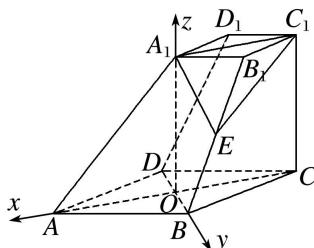

> [!faq]- 《专题11 利用空间向量计算2面角的问题-立体几何（理科）》例题解析
>
> > [!success]- **【答案】** 详见解析
>
> > [!note]- **【分析】**
> > 本题未单列分析。
>
> > [!note]- **【解析】**
> > (1)求证： $AA_{1} \perp BD;$
> > (2)求二面角 $E-A_{1}C_{1}-C$ 的余弦值.
> > 
> > 解析 (1)因为 $C_1C \perp$ 底面ABCD，所以 $C_1C \perp BD$ 。因为底面ABCD是菱形，所以 $BD \perp AC$ 。又 $AC \cap CC_1 = C$ ， $AC, CC_1 \subset$ 平面 $ACC_1A_1$ ，所以 $BD \perp$ 平面 $ACC_1A_1$ 。
> > 又 $AA_{1} \subset$ 平面 $ACC_{1}A_{1}$ ，所以 $BD \perp AA_{1}$ .
> > (2)如图，设 AC 交 BD 于点 O，依题意， $A_{1}C_{1}//OC$ 且 $A_{1}C_{1}=OC$
> > 
> > 所以四边形 $A_{1}OCC_{1}$ 为平行四边形，所以 $A_{1}O \parallel CC_{1}$ ，且 $A_{1}O = CC_{1}$ 。所以 $A_{1}O \perp$ 底面 ABCD。
> > 以 O 为原点，OA，OB， $OA_{1}$ 所在直线分别为 x 轴，y 轴，z 轴建立空间直角坐标系 O-xyz.
> > 则 $A(2\sqrt{3},0,0)$ ， $A_{1}(0,0,4)$ ， $C_{1}(-2\sqrt{3},0,4)$ ， $B(0,2,0)$ ， $\overrightarrow{AB}=(-2\sqrt{3},2,0)$ 。由 $\overrightarrow{A_{1}B_{1}}=\frac{1}{2}\overrightarrow{AB}$ ，得 $B_{1}(-\sqrt{3},1,4)$ .
> > 因为 E 是棱 $BB_{1}$ 的中点，所以 $E\left(-\frac{\sqrt{3}}{2},\frac{3}{2},2\right)$ 所以 $\overrightarrow{EA}_{1}=\left(\frac{\sqrt{3}}{2},-\frac{3}{2},2\right),\quad\overrightarrow{A_{1}C_{1}}=(-2\sqrt{3},0,0)$ .
> > 设 $n=(x,y,z)$ 为平面 $EA_{1}C_{1}$ 的法向量，则 $\left\{\begin{aligned}&n\cdot A_{1}\overrightarrow{C}_{1}=-2\sqrt{3}x=0,\\ &n\cdot\overrightarrow{EA}_{1}=\frac{\sqrt{3}}{2}x-\frac{3}{2}y+2z=0,\end{aligned}\right.$ 取 z=3，得 $n=(0,4,3)$
> > 取平面 $A_{1}C_{1}C$ 的法向量 $m=(0,1,0)$ ,
> > 又由图可知，二面角 $E-A_{1}C_{1}-C$ 为锐二面角，
> > 设二面角 $E-A_{1}C_{1}-C$ 的平面角为 $\theta$ ，则 $\cos\theta=\frac{|m\cdot n|}{|m||n|}=\frac{4}{5}$ ,
> > 所以二面角 $E-A_{1}C_{1}-C$ 的余弦值为 $\frac{4}{5}$ .
> > ## 【对点训练】
