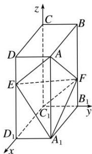

> [!faq]- 《专题11 利用空间向量计算2面角的问题-立体几何（理科）》例题解析
>
> > [!success]- **【答案】** A
>
> > [!note]- **【分析】**
> > 本题未单列分析。
>
> > [!note]- **【解析】**
> > 解析
> > (1) 设 AB = a, AD = b, $AA_{1} = c$ ，如图，
> >
> > 
> >
> > 以 $C_{1}$ 为坐标原点， $\overrightarrow{C_{1}D_{1}}$ ， $\overrightarrow{C_{1}B_{1}}$ ， $\overrightarrow{C_{1}C}$ 的方向分别为 x 轴，y 轴，z 轴正方向，建立空间直角坐标系 $C_{1}xyz$ 。
> >
> > 连接 $C_{1}F$ ，则 $C_{1}(0,0,0)$ ， $A(a,b,c)$ ， $E\left(a,0,\frac{2}{3}c\right)$ ， $F\left(0,b,\frac{1}{3}c\right)$ ，
> >
> > $\overrightarrow{EA}=\left(0,\ b,\ \frac{1}{3}c\right),\ \overrightarrow{C_{1}F}=\left(0,\ b,\ \frac{1}{3}c\right),\ \text{所以}\ \overrightarrow{EA}=\overrightarrow{C_{1}F},\ \text{所以}\ EA\parallel C_{1}F,$
> >
> > 即 A, E, F, $C_{1}$ 四点共面，所以点 $C_{1}$ 在平面 AEF 内.
> >
> > (2)由已知得 $A(2, 1, 3)$ ， $E(2, 0, 2)$ ， $F(0, 1, 1)$ ， $A_{1}(2, 1, 0)$ ，
> >
> > 则 $\overrightarrow{AE} = (0, -1, -1)$ , $\overrightarrow{AF} = (-2, 0, -2)$ , $\overrightarrow{A_1E} = (0, -1, 2)$ , $\overrightarrow{A_1F} = (-2, 0, 1)$ .
> >
> > 设 $\boldsymbol{n}_{1}=(x_{1},y_{1},z_{1})$ 为平面 AEF 的法向量，则 $\left\{\begin{aligned}\boldsymbol{n}_{1}\cdot\overrightarrow{AE}&=0,\\ \boldsymbol{n}_{1}\cdot\overrightarrow{AF}&=0,\end{aligned}\right.$ 即 $\left\{\begin{aligned}-y_{1}-z_{1}&=0,\\ -2x_{1}-2z_{1}&=0,\end{aligned}\right.$
> >
> > 可取 $n_{1}=(-1,-1,1)$ .
> >
> > 设 $\boldsymbol{n}_{2}=(x_{2},y_{2},z_{2})$ 为平面 $A_{1}EF$ 的法向量，则 $\left\{\begin{aligned}\boldsymbol{n}_{2}\cdot\overrightarrow{A_{1}E}=0,\\ \boldsymbol{n}_{2}\cdot\overrightarrow{A_{1}F}=0,\end{aligned}\right.$ 即 $\left\{\begin{aligned}-y_{2}+2z_{2}=0,\\ -2x_{2}+z_{2}=0,\end{aligned}\right.$ 同理可取 $n_{2}=\left(\frac{1}{2},2,1\right)$ .
> > 因为 $\cos<n_{1},\quad n_{2}>\frac{n_{1}\cdot n_{2}}{|n_{1}|\cdot|n_{2}|}=-\frac{\sqrt{7}}{7}$ 所以平面 AEF 与平面 $EFA_{1}$ 夹角的正弦值为 $\frac{\sqrt{42}}{7}$ .
