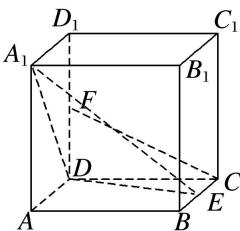

<!-- question-source:start -->
2. 如图，在棱长为 2 的正方体 $ABCD-A_{1}B_{1}C_{1}D_{1}$ 中，E 是 BC 的中点，F 是 $DD_{1}$ 的中点.

(1)求证： $CF \parallel$ 平面 $A_{1}DE$ ;

(2)求平面 $A_{1}DE$ 与平面 $A_{1}DA$ 夹角的余弦值.

<!-- question-source:end -->

![[高中/总复习/专题/立体几何/专题11 利用空间向量计算2面角的问题-立体几何（理科）/考点01_棱柱_台_模型/对点训练/answers/Q00043736A1.md]]
