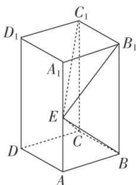
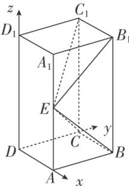

> [!faq]- 《专题11 利用空间向量计算2面角的问题-立体几何（理科）》例题解析
>
> > [!success]- **【答案】** 详见解析
>
> > [!note]- **【分析】**
> > 本题未单列分析。
>
> > [!note]- **【解析】**
> > (1)证明： $BE \perp$ 平面 $EB_{1}C_{1}$ ;
> > (2)若 $AE = A_{1}E$ ，求二面角 $B - EC - C_{1}$ 的正弦值.
> > 
> > 3. 解析 (1)由已知，得 $B_{1}C_{1} \perp$ 平面 $ABB_{1}A_{1}$ ，由于 $BE \subset$ 平面 $ABB_{1}A_{1}$ ，
> > 故 $B_{1}C_{1} \perp BE$ 。又 $BE \perp EC_{1}$ ， $B_{1}C_{1} \cap EC_{1} = C_{1}$ ，所以 $BE \perp$ 平面 $EB_{1}C_{1}$
> > (2)由(1)知 $\angle BEB_{1}=90^{\circ}$ ．由题设知 Rt $\triangle ABE\cong$ Rt $\triangle A_{1}B_{1}E$ ，所以 $\angle AEB=45^{\circ}$ ，故 $AE=AB$ ， $AA_{1}=2AB$ ．
> > 以 D 为坐标原点， $\overrightarrow{DA}$ 的方向为 x 轴正方向， $\overrightarrow{DC}$ 的方向为 y 轴正方向， $\overrightarrow{DD_{1}}$ 的方向为 z 轴正方向， $|\overrightarrow{DA}|$
> > 为单位长度，建立如图所示的空间直角坐标系 Dxyz，
> > 
> > 则 $C(0, 1, 0)$ ， $B(1, 1, 0)$ ， $C_{1}(0, 1, 2)$ ， $E(1, 0, 1)$ ，
> > 所以 $\overrightarrow{CB}=(1,0,0)$ ， $\overrightarrow{CE}=(1,-1,1)$ ， $CC_{1}=(0,0,2)$ .
> > 设平面 EBC 的法向量为 $\boldsymbol{n}=(x_{1},y_{1},z_{1})$ ，则 $\left\{\begin{aligned}\vec{CB}\cdot\boldsymbol{n}&=0,\\ \vec{CE}\cdot\boldsymbol{n}&=0,\end{aligned}\right.$ 即 $\left\{\begin{aligned}x_{1}&=0,\\ x_{1}-y_{1}+z_{1}&=0,\end{aligned}\right.$
> > 所以可取 $n=(0,-1,-1)$ .
> > 设平面 $ECC_{1}$ 的法向量为 $\boldsymbol{m}=(x_{2},y_{2},z_{2})$ ，则 $\left\{\begin{aligned}CC_{1}\cdot\boldsymbol{m}&=0,\\ \vec{CE}\cdot\boldsymbol{m}&=0,\end{aligned}\right.$ 即 $\left\{\begin{aligned}2z_{2}&=0,\\ x_{2}-y_{2}+z_{2}&=0,\end{aligned}\right.$
> > 所以可取 $m=(1,1,0)$ . 于是 $\cos<n,\quad m>=\frac{n\cdot m}{|n||m|}=-\frac{1}{2}$ .
> > 所以二面角 $B-EC-C_{1}$ 的正弦值为 $\frac{\sqrt{3}}{2}$ .
