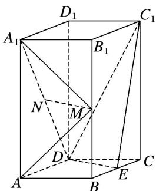
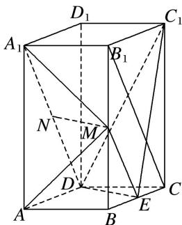
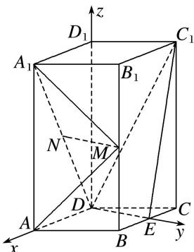

> [!faq]- 《专题11 利用空间向量计算2面角的问题-立体几何（理科）》例题解析
>
> > [!success]- **【答案】** 详见解析
>
> > [!note]- **【分析】**
> > 本题未单列分析。
>
> > [!note]- **【解析】**
> > (1)证明： $MN / /$ 平面 $C_1DE$
> > (2)求平面 $AMA_{1}$ 与平面 $MA_{1}N$ 夹角的正弦值.
> > 
> > 4. 解析 (1)如图, 连接 $B_{1} C$ , $M E$ . 因为 $M$ , $E$ 分别为 $B B_{1}$ , $B C$ 的中点,所以 $ME \parallel B_{1}C$ ，且 $ME = \frac{1}{2}B_{1}C$ 。又因为 N 为 $A_{1}D$ 的中点，所以 $ND = \frac{1}{2}A_{1}D$ 。
> > 由题设知 $A_{1}B_{1} \parallel DC$ 且 $A_{1}B_{1} = DC$ ，可得 $B_{1}C \parallel A_{1}D$ 且 $B_{1}C = A_{1}D$ ，故 $ME \parallel ND$ 且 ME = ND，
> > 因此四边形 MNDE 为平行四边形，MN//ED。又 MN⊂平面 C₁DE，ED⊂平面 C₁DE，
> > 所以 MN// 平面 C₁DE.
> > 
> > (2)由已知可得 $DE \perp DA$ ，以 D 为坐标原点， $\overrightarrow{DA}$ 的方向为 x 轴正方向，建立如图所示的空间直角坐标系 Dxyz，
> > 
> > 则 $A(2, 0, 0)$ ， $A_{1}(2, 0, 4)$ ， $M(1, \sqrt{3}, 2)$ ， $N(1, 0, 2)$ ， $\overrightarrow{A_{1}A} = (0, 0, -4)$ ， $\overrightarrow{A_{1}M} = (-1, \sqrt{3}, -2)$ ， $\overrightarrow{A_{1}N} = (-1, 0, -2)$ ， $\overrightarrow{MN} = (0, -\sqrt{3}, 0)$ .
> > 设 $\boldsymbol{m}=(x,y,z)$ 为平面 $A_{1}MA$ 的一个法向量，则 $\left\{\begin{aligned}\boldsymbol{m}\cdot\overrightarrow{A_{1}M}&=0,\\ \boldsymbol{m}\cdot\overrightarrow{A_{1}A}&=0,\end{aligned}\right.$
> > 所以 $\left\{\begin{aligned}-x+\sqrt{3}y-2z=0,\\ -4z=0,\end{aligned}\right.$ 可得 $m=(\sqrt{3},1,0)$ .
> > 设 $\boldsymbol{n}=(p,\quad q,\quad r)$ 为平面 $A_{1}MN$ 的一个法向量，则 $\left\{\begin{aligned}\boldsymbol{n}\cdot\overrightarrow{MN}&=0,\\\boldsymbol{n}\cdot\overrightarrow{A_{1}N}&=0,\end{aligned}\right.$
> > 所以 $\left\{\begin{aligned}-\sqrt{3}q&=0,\\ -p&-2r=0,\end{aligned}\right.$ 可取 $n=(2,0,-1)$ .
> > 于是 $\cos<m,\quad n>=\frac{m\cdot n}{|m||n|}=\frac{2\sqrt{3}}{2\times\sqrt{5}}=\frac{\sqrt{15}}{5},$
> > 所以平面 $AMA_{1}$ 与平面 $MA_{1}N$ 夹角的正弦值为 $\frac{\sqrt{10}}{5}$ .
