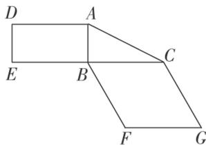
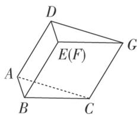
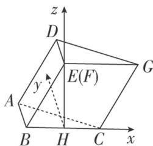

> [!faq]- 《专题11 利用空间向量计算2面角的问题-立体几何（理科）》例题解析
>
> > [!success]- **【答案】** 详见解析
>
> > [!note]- **【分析】**
> > 本题未单列分析。
>
> > [!note]- **【解析】**
> > (1)证明：图2中的A，C，G，D四点共面，且平面ABC⊥平面BCGE；
> > (2)求图 2 中的二面角 B-CG-A 的大小.
> > 
> > 图1
> > 
> > 图2
> > 1. 解析
> > (1)由已知得 $AD \parallel BE$ ， $CG \parallel BE$ ，所以 $AD \parallel CG$ ，所以 $AD$ ， $CG$ 确定一个平面，从而 $A$ ， $C$ ， $G$ ， $D$ 四点共面。由已知得 $AB \perp BE$ ， $AB \perp BC$ ，且 $BE \cap BC = B$ ，所以 $AB \perp$ 平面 $BCGE$ 。又因为 $AB \subset$ 平面 $ABC$ ，所以平面 $ABC \perp$ 平面 $BCGE$ 。
> > (2)作 $EH \perp BC$ ，垂足为 $H$ 。因为 $EH \subset$ 平面 $BCGE$ ，平面 $BCGE \perp$ 平面 $ABC$ ，平面 $BCGE \cap$ 平面 $ABC = BC$ ，所以 $EH \perp$ 平面 $ABC$ 。由已知，菱形 $BCGE$ 的边长为 2， $\angle EBC = 60^\circ$ ，可求得 $BH = 1$ ， $EH = \sqrt{3}$ 。
> > 
> > 以 H 为坐标原点， $\overrightarrow{HC}$ 的方向为 x 轴的正方向，建立如图所示的空间直角坐标系 Hxyz，则 $A(-1, 1, 0)$ ， $C(1, 0, 0)$ ， $G(2, 0, \sqrt{3})$ ， $\overrightarrow{CG}=(1, 0, \sqrt{3})$ ， $\overrightarrow{AC}=(2, -1, 0)$ .
> > 设平面 ACGD 的法向量为 $\boldsymbol{n}=(x,y,z)$ ，则 $\left\{\begin{aligned}\overrightarrow{CG}\cdot\boldsymbol{n}&=0,\\ \overrightarrow{AC}\cdot\boldsymbol{n}&=0,\end{aligned}\right.$ 即 $\left\{\begin{aligned}x+\sqrt{3}z&=0,\\ 2x-y&=0.\end{aligned}\right.$
> > 所以可取 $n=(3,6,-\sqrt{3})$ 。又平面 BCGE 的法向量可取 $m=(0,1,0)$
> > 所以 $\cos<n,\quad m>=\frac{n\cdot m}{|n||m|}=\frac{\sqrt{3}}{2}$ . 因此二面角 B-CG-A 的大小为 $30^{\circ}$ .
