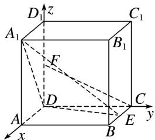

> [!faq]- 《专题11 利用空间向量计算2面角的问题-立体几何（理科）》例题解析
>
> > [!success]- **【答案】** 详见解析
>
> > [!note]- **【解析】**
> > 解析
> > (1)分别以 $DA, DC, DD_{1}$ 所在直线为 $x$ 轴， $y$ 轴， $z$ 轴建立空间直角坐标系，
> >
> > 
> >
> > 则 $A_{1}(2,0,2)$ ， $E(1,2,0)$ ， $D(0,0,0)$ ， $C(0,2,0)$ ， $F(0,0,1)$ ，
> >
> > 则 $\overrightarrow{DA_{1}}=(2,0,2)$ ， $\overrightarrow{DE}=(1,2,0)$ ， $\overrightarrow{CF}=(0,-2,1)$ ,
> >
> > 设平面 $A_{1}DE$ 的法向量 $\boldsymbol{n}=(a,b,c)$ ，则 $\left\{\begin{aligned}\boldsymbol{n}\cdot\overrightarrow{DA_{1}}=2a+2c=0,\\ \boldsymbol{n}\cdot\overrightarrow{DE}=a+2b=0,\end{aligned}\right.$ 取 $\boldsymbol{n}=(-2,1,2)$ ,
> >
> > ∴ $\overrightarrow{CF} \cdot n = (0, -2, 1) \cdot (-2, 1, 2) = 0$ ，又 $CF \not\subset$ 平面 $A_{1}DE$ ，∴ $CF \parallel$ 平面 $A_{1}DE$ .
> >
> > (2) $\vec{DC} = (0, 2, 0)$ 是平面 $A_{1}DA$ 的法向量， $\therefore \cos < n, \vec{DC} > = \frac{(-2, 1, 2) \cdot (0, 2, 0)}{\sqrt{(-2)^{2} + 1^{2} + 2^{2}} \cdot \sqrt{0 + 2^{2} + 0}} = \frac{1}{3}$ ,
> >
> > 即平面 $A_{1}DE$ 与平面 $A_{1}DA$ 夹角的余弦值为 $\frac{1}{3}$ .
