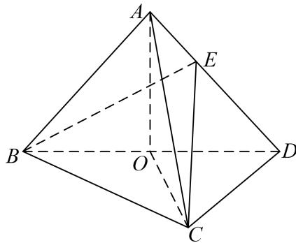

<!-- question-source:start -->
(1)证明： $OA\bot CD$

(2)若 $\triangle OCD$ 是边长为1的等边三角形，点 $E$ 在棱 $AD$ 上， $DE=2EA$ ，且二面角 $E-BC-D$ 的大小为 $45^{\circ}$ ，求三棱锥 $A-BCD$ 的体积.

<!-- question-source:end -->

![[高中/总复习/专题/立体几何/专题11 利用空间向量计算2面角的问题-立体几何（理科）/考点02_棱_圆_锥模型/例题/answers/Q00043740A1.md]]
