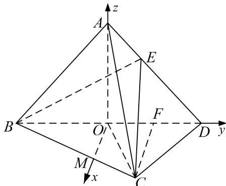

<!-- question-source:start -->
(1) 因为 AB = AD，O 为 BD 的中点，所以 $AO \perp BD$ ，

又平面 $ABD \perp$ 平面 BCD，平面 $ABD \cap$ 平面 BCD = BD，AO < 平面 BCD，

所以 $AO \perp$ 平面 BCD，又 $CD \subset$ 平面 BCD，所以 $OA \perp CD$ ;

(2)取 OD 的中点 F，因为 $\triangle OCD$ 为正三角形，所以 $CF \perp OD$ ，

过 O 作 OM//CF 与 BC 交于点 M，则 OM⊥OD，所以 OM，OD，OA 两两垂直，

以点 O 为坐标原点，分别以 OM, OD, OA 为 x 轴，y 轴，z 轴建立空间直角坐标系如图所示，则 $B(0, -1, 0)$ ， $C(\frac{\sqrt{3}}{2}, \frac{1}{2}, 0)$ ， $D(0, 1, 0)$ ，设 $A(0, 0, t)$ ，则 $E(0, \frac{1}{3}, \frac{2t}{3})$ ，

因为 $OA \perp$ 平面 BCD，故平面 BCD 的一个法向量为 $\overrightarrow{OA} = (0, 0, t)$ ,

设平面 BCE 的法向量为 $\boldsymbol{n}=(x,y,z)$ ，又 $\overrightarrow{BC}=(\frac{\sqrt{3}}{2},\frac{3}{2},0)$ ， $\overrightarrow{BE}=(0,\frac{4}{3},\frac{2t}{3})$

所以由 $\left\{ \begin{array}{l} n \cdot \overrightarrow{BC} = 0, \\ n \cdot \overrightarrow{BE} = 0, \end{array} \right.$ 得 $\left\{ \begin{array}{l} \frac{\sqrt{3}}{2} x - \frac{3}{2} y = 0, \\ \frac{4}{3} y + \frac{2t}{3} z = 0, \end{array} \right.$ 令 $x = \sqrt{3}$ ，则 $n = (\sqrt{3}, -1, \frac{2}{t})$ .

因为二面角 $E - BC - D$ 的大小为 $45^{\circ}$ ，所以 $\cos < n$ ， $\overrightarrow{OA} > = \frac{n \cdot \overrightarrow{OA}}{|n||\overrightarrow{OA}|} = \frac{2}{t\sqrt{4 + \frac{4}{t^2}}} = \frac{\sqrt{2}}{2}$ ，
<!-- question-source:end -->

![[高中/总复习/专题/立体几何/专题11 利用空间向量计算2面角的问题-立体几何（理科）/考点02_棱_圆_锥模型/例题/answers/Q00043741A1.md]]
