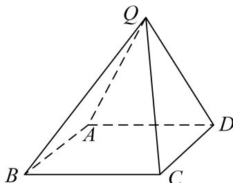

<!-- question-source:start -->
[例 3] (2021·全国新 II) 在四棱锥 Q-ABCD 中，底面 ABCD 是正方形，若 AD=2， $QD=QA=\sqrt{5}$ ，QC=3.

(1)证明：平面 $QAD \perp$ 平面 ABCD;

(2)求二面角 B-QD-A 的平面角的余弦值.

<!-- question-source:end -->

![[高中/总复习/专题/立体几何/专题11 利用空间向量计算2面角的问题-立体几何（理科）/考点02_棱_圆_锥模型/例题/answers/Q00043742A1.md]]
