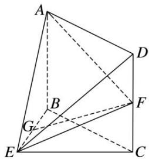

<!-- question-source:start -->
[例 4] 如图，在几何体 ABCDE 中，四边形 ABCD 是矩形， $AB \perp$ 平面 BEC， $BE \perp EC$ ，AB = BE = EC = 2，G，F 分别是线段 BE，DC 的中点.

(1)求证： $GF / /$ 平面ADE；

(2)求平面 AEF 与平面 BEC 夹角的余弦值.

<!-- question-source:end -->

![[高中/总复习/专题/立体几何/专题11 利用空间向量计算2面角的问题-立体几何（理科）/考点02_棱_圆_锥模型/例题/answers/Q00043743A1.md]]
