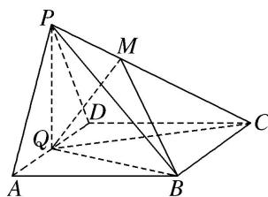
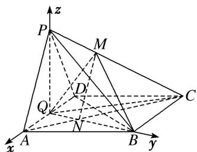

<!-- question-source:start -->
[例 5] 如图，在四棱锥 P-ABCD 中，底面 ABCD 是菱形， $\angle BAD=60^{\circ}$ ，Q 为 AD 的中点， $PQ\perp$ 平面 ABCD，PA=PD=AD=2，M 是棱 PC 上一点，且 $\frac{PM}{PC}=\frac{1}{3}$ .

(1)证明： $PA \parallel$ 平面 BMQ;

(2)求二面角 B-MQ-C 的余弦值.

(1)如图，连接 AC，交 BQ 于 N，连接 MN，∵底面 ABCD 是菱形，

$$
\therefore A Q \parallel B C, \therefore \triangle A N Q \sim \triangle C N B, \therefore \frac {A Q}{B C} = \frac {A N}{N C} = \frac {1}{2}, \therefore \frac {A N}{A C} = \frac {1}{3}, \text {又} \frac {P M}{P C} = \frac {1}{3}, \therefore \frac {P M}{P C} = \frac {A N}{A C} = \frac {1}{3},
$$

∴MN//PA，又MN⊂平面BMQ. PA∉平面BMQ，∴PA//平面BMQ.

(2)连接 BD，∵底面 ABCD 是菱形，且 $\angle BAD = 60^{\circ}$ ，∴ $\triangle BAD$ 是等边三角形，

又 Q 为 AD 的中点，∴ $BQ \perp AD$ 。由 $PQ \perp$ 平面 ABCD ，得 $PQ \perp AD$ 。

以 Q 为坐标原点，QA，QB，QP 所在的直线分别为 x 轴，y 轴，z 轴建立空间直角坐标系，则 $Q(0, 0, 0)$ ， $A(1, 0, 0)$ ， $B(0, \sqrt{3}, 0)$ ， $D(-1, 0, 0)$ ， $P(0, 0, \sqrt{3})$ ，

由 $\overrightarrow{AC} = \overrightarrow{AD} +\overrightarrow{AB} = (-2,0,0) + (-1,\sqrt{3},0) = (-3,\sqrt{3},0)$ ，可得点 $C(-2,\sqrt{3},0)$

设平面 PQC 的法向量为 $\boldsymbol{n}=(x,y,z)$ . 则 $\left\{\begin{aligned}n\cdot\overrightarrow{QP}&=0,\\ n\cdot\overrightarrow{QC}&=0,\end{aligned}\right.$ 即 $\left\{\begin{aligned}\sqrt{3}z&=0,\\ -2x+\sqrt{3}y&=0,\end{aligned}\right.$

令 x=3，得 $y=2\sqrt{3}$ ，z=0，∴ $n=(3,2\sqrt{3},0)$ ， $|n|=\sqrt{21}$ .

设平面 BMQ 的法向量为 $\boldsymbol{m}=(x_{1},y_{1},z_{1})$ ，则 $\left\{\begin{aligned}&m\cdot\overrightarrow{QB}=0,\\ &m\cdot\overrightarrow{MN}=0,\end{aligned}\right.$ $\because MN//PA,\therefore\left\{\begin{aligned}&m\cdot\overrightarrow{QB}=0,\\ &m\cdot\overrightarrow{PA}=0,\end{aligned}\right.$

即 $\left\{ \begin{array}{l} \sqrt{3} y_1 = 0, \\ x_1 - \sqrt{3} z_1 = 0, \end{array} \right.$ 令 $x_1 = \sqrt{3}$ ，则 $z_1 = 1$ ， $y_1 = 0$ ， $\therefore m = (\sqrt{3}, 0, 1)$ 是平面 $BMQ$ 的一个法向量.

设二面角 B-MQ-C 的平面角的大小为 $\theta$ ，则 $\cos\theta=\frac{m\cdot n}{|m||n|}=\frac{3\sqrt{7}}{14}$ ,

即二面角 B-MQ-C 的余弦值为 $\frac{3\sqrt{7}}{14}$ .
<!-- question-source:end -->

![[高中/总复习/专题/立体几何/专题11 利用空间向量计算2面角的问题-立体几何（理科）/考点02_棱_圆_锥模型/例题/answers/Q00043744A1.md]]
