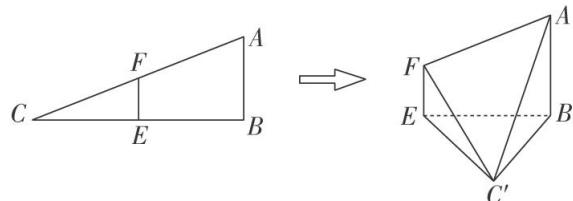
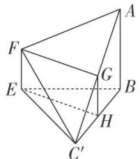
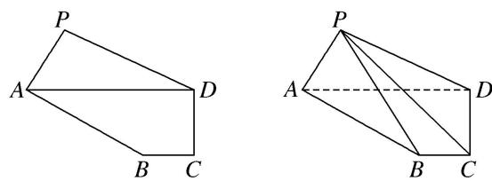
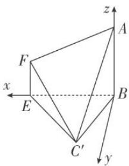

<!-- question-source:start -->
[例 7] 在 Rt△ABC 中，∠ABC=90°， $\tan\angle ACB=\frac{1}{2}$ . 已知 E, F 分别是 BC, AC 的中点．将△CEF 沿 EF 折起，使 C 到 C' 的位置且二面角 C'-EF-B 的大小是 60°．连接 C'B, C'A，如图：

(1)求证：平面 $C'FA \perp$ 平面 $ABC'$ ;

(2)求平面 $AFC'$ 与平面 $BEC'$ 所成二面角的大小.

(1)证法一：如图，设 $AC'$ 的中点为 G，连接 FG.

设 $BC'$ 的中点为 H，连接 GH，EH. $\because E, F$ 分别为 BC，AC 的中点，

$\therefore AF = FC'$ ， $BE = EC'$ ， $EF \parallel AB$ ， $EF = \frac{1}{2} AB$ ，又 $G$ ， $H$ 分别为 $AC'$ ， $BC'$ 的中点，

$\therefore FG \perp AC'$ , $EH \perp BC'$ , $GH \parallel AB$ , $GH = \frac{1}{2} AB$ , $\therefore EF \parallel GH$ ,

∴四边形 EHGF 为平行四边形．∴ $FG \perp BC'$ ，又 $AC' \cap BC' = C'$ ，∴ $FG \perp$ 平面 $ABC'$ ，

又 $FG \subset$ 平面 $C'FA$ , $\therefore$ 平面 $C'FA \perp$ 平面 $ABC'$ .

证法二：如图，建立空间直角坐标系，设 AB=2，则 $A(0,0,2)$ ， $B(0,0,0)$ ， $F(2,0,1)$ ， $E(2,0,0)$ ， $C'(1,\sqrt{3},0)$ .

  
图①  
图②

设平面 $ABC'$ 的法向量为 $\boldsymbol{a}=(x_{1}, y_{1}, z_{1})$ ,

$\because \overrightarrow{BA} = (0, 0, 2), \overrightarrow{BC}' = (1, \sqrt{3}, 0), \therefore \begin{cases} z_1 = 0, \\ x_1 + \sqrt{3}y_1 = 0, \end{cases}$ 令 $y_1 = 1$ ，则 $a = (-\sqrt{3}, 1, 0)$ ，

设平面 $C'FA$ 的法向量为 $\boldsymbol{b}=(x_{2}, y_{2}, z_{2})$ ,

$\because \overrightarrow{AF} = (2, 0, -1), \overrightarrow{AC}' = (1, \sqrt{3}, -2), \therefore \begin{cases} 2x_2 - z_2 = 0, \\ x_2 + \sqrt{3}y_2 - 2z_2 = 0, \end{cases}$ 令 $y_2 = \sqrt{3}$ ，则 $b = (1, \sqrt{3}, 2)$ .

$\because a\cdot b=0,\therefore$ 平面 $C^{\prime}FA\perp$ 平面 $ABC^{\prime}$ .

(2)如图，建立空间直角坐标系，设 AB=2，则 $A(0,0,2)$ ， $B(0,0,0)$ ， $F(2,0,1)$ ， $E(2,0,0)$ ， $C'(1,\sqrt{3},0)$ 。显然平面 $BEC'$ 的法向量 $m=(0,0,1)$ ，

设平面 $AFC'$ 的法向量 $n=(x, y, z)$ ，∵ $\overrightarrow{AC}'=(1,\sqrt{3}, -2)$ ， $\overrightarrow{AF}=(2, 0, -1)$ ，

$\therefore \left\{ \begin{array}{l} 2x - z = 0, \\ x + \sqrt{3}y - 2z = 0, \end{array} \right.$ 令 $x = 1$ ，则 $\pmb{n} = (1, \sqrt{3}, 2)$ .

$$
\cos <   \boldsymbol {m}, \quad \boldsymbol {n} > = \frac {\boldsymbol {m} \cdot \boldsymbol {n}}{| \boldsymbol {m} | | \boldsymbol {n} |} = \frac {\sqrt {2}}{2},
$$

观察图形可知，平面 $AFC'$ 与平面 $BEC'$ 所成二面角的平面角为锐角.

∴平面 $AFC'$ 与平面 $BEC'$ 所成二面角的大小为 $45^{\circ}$ .
<!-- question-source:end -->

![[高中/总复习/专题/立体几何/专题11 利用空间向量计算2面角的问题-立体几何（理科）/考点02_棱_圆_锥模型/例题/answers/Q00043746A1.md]]
