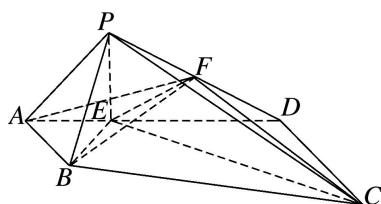

<!-- question-source:start -->
[例 9] 如图, 在四棱锥 P-ABCD 中, 侧面 PAD⊥底面 ABCD, 底面 ABCD 为直角梯形, 其中 AB∥CD, ∠CDA=90°, CD=2AB=2, AD=3, PA=√5, PD=2√2, 点 E 在棱 AD 上且 AE=1, 点 F 为棱 PD 的中点.

(1)证明：平面 $BEF \perp$ 平面 $PEC$ ;

(2)求二面角 A-BF-C 的余弦值.

<!-- question-source:end -->

![[高中/总复习/专题/立体几何/专题11 利用空间向量计算2面角的问题-立体几何（理科）/考点02_棱_圆_锥模型/例题/answers/Q00043748A1.md]]
