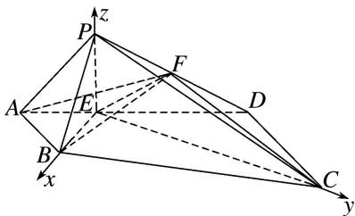

<!-- question-source:start -->
[例 9] 如图, 在四棱锥 P-ABCD 中, 侧面 PAD⊥底面 ABCD, 底面 ABCD 为直角梯形, 其中 AB∥CD, ∠CDA=90°, CD=2AB=2, AD=3, PA=√5, PD=2√2, 点 E 在棱 AD 上且 AE=1, 点 F 为棱 PD 的中点.

(1)证明：平面 $BEF \perp$ 平面 $PEC$ ;

(2)求二面角 A-BF-C 的余弦值.

(1) 在 Rt△ABE 中，由 AB = AE = 1，得 ∠AEB = 45°，

同理在 Rt△CDE 中，由 CD=DE=2，得 $\angle DEC=45^{\circ}$ ，所以 $\angle BEC=90^{\circ}$ ，即 $BE\perp EC$ .

在 $\triangle PAD$ 中， $\cos \angle PAD = \frac{PA^2 + AD^2 - PD^2}{2PA \cdot AD} = \frac{5 + 9 - 8}{2 \times 3 \times \sqrt{5}} = \frac{\sqrt{5}}{5}$ ，

在 $\triangle PAE$ 中， $PE^2 = PA^2 +AE^2 -2PA\cdot AE\cdot \cos \angle PAE = 5 + 1 - 2\times \sqrt{5}\times 1\times \frac{\sqrt{5}}{5} = 4,$

所以 $PE^{2}+AE^{2}=PA^{2}$ ，即 $PE \perp AD$ .

又平面 $PAD \perp$ 平面 ABCD，平面 $PAD \cap$ 平面 ABCD = AD， $PE \subset$ 平面 PAD，

所以 $PE \perp$ 平面 ABCD，所以 $PE \perp BE$ .

又因为 $CE \cap PE = E$ ，CE， $PE \subset$ 平面 PEC，所以 $BE \perp$ 平面 PEC，

又 $BE \subset$ 平面 BEF，所以平面 $BEF \perp$ 平面 PEC.

(2)由
(1)知 $EB$ ， $EC$ ， $EP$ 两两垂直，故以 $E$ 为坐标原点，以射线 $EB$ ， $EC$ ， $EP$ 分别为 $x$ 轴、 $y$ 轴、 $z$ 轴的正半轴建立如图所示的空间直角坐标系，则

$B(\sqrt{2}, 0, 0), C(0, 2\sqrt{2}, 0), P(0, 0, 2), A\left[\frac{\sqrt{2}}{2}, -\frac{\sqrt{2}}{2}, 0\right], D(-\sqrt{2}, \sqrt{2}, 0), F\left[-\frac{\sqrt{2}}{2}, \frac{\sqrt{2}}{2}, 1\right],$

$$
\overrightarrow {A B} = \left[ \frac {\sqrt {2}}{2}, \frac {\sqrt {2}}{2}, 0 \right], \overrightarrow {B F} = \left[ - \frac {3 \sqrt {2}}{2}, \frac {\sqrt {2}}{2}, 1 \right], \overrightarrow {B C} = (- \sqrt {2}, 2 \sqrt {2}, 0),
$$

设平面 ABF 的法向量为 $\boldsymbol{m}=(x_{1},y_{1},z_{1})$ ，则 $\left\{\begin{aligned}\boldsymbol{m}\cdot\overrightarrow{AB}&=\frac{\sqrt{2}}{2}x_{1}+\frac{\sqrt{2}}{2}y_{1}=0,\\ \boldsymbol{m}\cdot\overrightarrow{BF}&=-\frac{3\sqrt{2}}{2}x_{1}+\frac{\sqrt{2}}{2}y_{1}+z_{1}=0,\end{aligned}\right.$

不妨设 $x_{1}=1$ ，则 $m=(1,-1,2\sqrt{2})$ ,

设平面 BFC 的法向量为 $\boldsymbol{n}=(x_{2},y_{2},z_{2})$ ，则 $\left\{\begin{aligned}\boldsymbol{n}\cdot\overrightarrow{BC}&=-\sqrt{2}x_{2}+2\sqrt{2}y_{2}=0,\\ \boldsymbol{n}\cdot\overrightarrow{BF}&=-\frac{3\sqrt{2}}{2}x_{2}+\frac{\sqrt{2}}{2}y_{2}+z_{2}=0,\end{aligned}\right.$

不妨设 $y_{2}=2$ ，则 $n=(4,2,5\sqrt{2})$ ,

记二面角 A-BF-C 为 $\theta$ (由图知应为钝角)，则 $\cos\theta=-\frac{|m\cdot n|}{|m||n|}=-\frac{|4-2+20|}{\sqrt{10}\times\sqrt{70}}=-\frac{11\sqrt{7}}{35}$ ,

故二面角 A-BF-C 的余弦值为 $-\frac{11\sqrt{7}}{35}$ .
<!-- question-source:end -->

![[高中/总复习/专题/立体几何/专题11 利用空间向量计算2面角的问题-立体几何（理科）/考点02_棱_圆_锥模型/例题/answers/Q00043748A1.md]]
