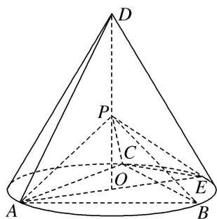
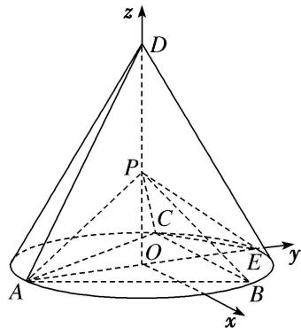

> [!faq]- 《专题11 利用空间向量计算2面角的问题-立体几何（理科）》例题解析
>
> > [!success]- **【答案】** 详见解析
>
> > [!note]- **【分析】**
> > 本题未单列分析。
>
> > [!note]- **【解析】**
> > (1)证明： $PA \perp$ 平面 PBC;
> > (2)求二面角 B-PC-E 的余弦值.
> > 
> > 解析 (1) 设 DO=a，由题意可得 $PO=\frac{\sqrt{6}}{6}a$ ， $AO=\frac{\sqrt{3}}{3}a$ ，AB=a，PA=PB=PC= $\frac{\sqrt{2}}{2}a$ .
> > 因此 $PA^{2}+PB^{2}=AB^{2}$ ，从而 $PA\perp PB$ 。又 $PA^{2}+PC^{2}=AC^{2}$ ，
> > 故 $PA \perp PC$ 。又 $PB \cap PC = P$ ， $PB$ ， $PC \subset$ 平面 $PBC$ ，所以 $PA \perp$ 平面 $PBC$ 。
> > 
> > (2)以 O 为坐标原点， $\overrightarrow{OE}$ 的方向为 y 轴正方向， $|\overrightarrow{OE}|$ 为单位长度，建立如图所示的空间直角坐标系 Oxyz. 由题设可得 $E(0, 1, 0)$ ， $A(0, -1, 0)$ ， $C\left(-\frac{\sqrt{3}}{2}, \frac{1}{2}, 0\right)$ ， $P\left(0, 0, \frac{\sqrt{2}}{2}\right)$ .
> > 所以 $\overrightarrow{EC}=\left(-\frac{\sqrt{3}}{2},-\frac{1}{2},0\right),\quad\overrightarrow{EP}=\left(0,-1,\frac{\sqrt{2}}{2}\right).$
> > 设 $m=(x,y,z)$ 是平面 PCE 的法向量，则 $\left\{\begin{aligned}m\cdot\overrightarrow{EP}&=0,\\ m\cdot\overrightarrow{EC}&=0,\end{aligned}\right.$ 即 $\left\{\begin{aligned}-y+\frac{\sqrt{2}}{2}z&=0,\\ -\frac{\sqrt{3}}{2}x-\frac{1}{2}y&=0.\end{aligned}\right.$
> > 可取 $m = \left(-\frac{\sqrt{3}}{3}, 1, \sqrt{2}\right)$ .
> > 由(1)知 $\overrightarrow{AP}=\left(0,1,\frac{\sqrt{2}}{2}\right)$ 是平面PCB的一个法向量，记 $n=\overrightarrow{AP}$ ,
> > 则 $\cos < n, m > = \frac{n \cdot m}{|n| \cdot |m|} = \frac{2\sqrt{5}}{5}$ . 所以二面角 $B - PC - E$ 的余弦值为 $\frac{2\sqrt{5}}{5}$ .
