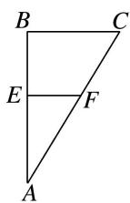
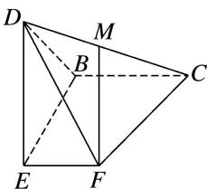
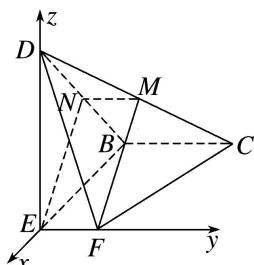

> [!faq]- 《专题11 利用空间向量计算2面角的问题-立体几何（理科）》例题解析
>
> > [!success]- **【答案】** 详见解析
>
> > [!note]- **【分析】**
> > 本题未单列分析。
>
> > [!note]- **【解析】**
> > (1)证明： $MF \perp$ 平面 BCD;
> > (2)若 $DE \perp BE$ ，求平面 EMF 与平面 MFC 夹角的余弦值.
> > 
> > 
> > 解析 (1)如图，取 $DB$ 的中点 $N$ ，连接 $MN$ ， $EN$
> > ∵MN//BC， $MN=\frac{1}{2}BC$ ， $EF//BC$ ， $EF=\frac{1}{2}BC$ ，∴四边形EFMN是平行四边形，
> > ∵ $EF \perp BE$ , $EF \perp DE$ , $BE \cap DE = E$ , BE, $DE \subset$ 平面 BDE,
> > ∴EF⊥平面 BDE，∴EF⊥EN，∴MF⊥MN，
> > 在 $\triangle DFC$ 中，DF=FC，又∵M为CD的中点，∴ $MF\perp CD$ ，
> > 又∵CD∩MN=M，CD，MN⊂平面BCD，∴MF⊥平面BCD.
> > (2) $\because DE\perp BE,\ DE\perp EF,\ BE\cap EF=E,\ BE,\ EF\subset$ 平面 BEF, $\therefore DE\perp$ 平面 BEF,
> > 以 E 为原点，BE，EF，ED 所在直线分别为 x，y，z 轴，建立空间直角坐标系，设 BC=2，
> > 
> > 则 $E(0, 0, 0)$ ， $F(0, 1, 0)$ ， $C(-2, 2, 0)$ ， $M(-1, 1, 1)$ ，
> > ∴ $\overrightarrow{EF}=(0,1,0),\overrightarrow{FM}=(-1,0,1),\overrightarrow{CF}=(2,-1,0),$ 设平面 EMF 的一个法向量为 $\boldsymbol{m}=(x,y,z)$ ，则 $\left\{\begin{aligned}\boldsymbol{m}\cdot\vec{EF}&=y=0,\\ \boldsymbol{m}\cdot\vec{FM}&=-x+z=0,\end{aligned}\right.$ 取 x=1，得 $\boldsymbol{m}=(1,0,1)$ ，同理，得平面 CMF 的一个法向量为 $\boldsymbol{n}=(1,2,1)$ ，
> > 设平面 EMF 与平面 MFC 的夹角为 $\theta$ ，则 $\cos\theta=\frac{|m\cdot n|}{|m|\cdot|n|}=\frac{\sqrt{3}}{3}$ ∴ 平面 EMF 与平面 MFC 夹角的余弦值为 $\frac{\sqrt{3}}{3}$ .
