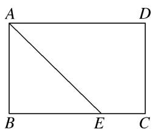
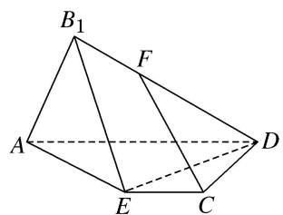
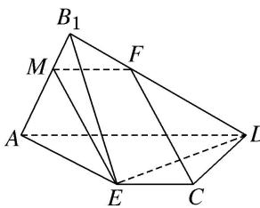
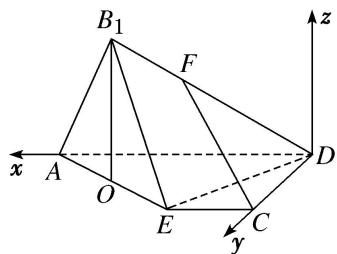
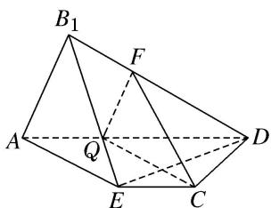
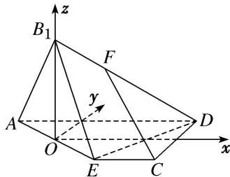
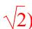

> [!faq]- 《专题11 利用空间向量计算2面角的问题-立体几何（理科）》例题解析
>
> > [!success]- **【答案】** 详见解析
>
> > [!note]- **【分析】**
> > 本题未单列分析。
>
> > [!note]- **【解析】**
> > (1)证明： $CF \parallel$ 平面 $B_{1}AE$ ;
> > (2)当三棱锥 $B_{1}-ADE$ 的体积最大时，求二面角 $B_{1}-DE-C$ 的余弦值.
> > 
> > 图①
> > 
> > 图②
> > 解析 法一：(1)依题意得，在矩形ABCD中， $AB = 2$ ， $BC = 3$ ， $BE = 2EC$ ，所以 $AD = 3$ ， $EC = 1$ 如图③，在线段 $B_{1}A$ 上取一点 $M$ ，满足 $AM = 2MB_{1}$ ，连接MF，ME，又 $DF = 2FB_{1}$ 所以 $\frac{B_1M}{MA} = \frac{B_1F}{FD}$ ，故 $FM / / AD$ ， $FM = \frac{1}{3} AD$ 。又 $EC / / AD$ ，所以 $EC / / FM$ 因为 $FM = \frac{1}{3} AD = 1$ ，所以 $EC = FM$ ，所以四边形FMEC为平行四边形，所以 $CF / / EM$ 又 $CF\notin$ 平面 $B_{1}AE$ ， $EM\subset$ 平面 $B_{1}AE$ ，所以 $CF / /$ 平面 $B_{1}AE$
> > 
> > 图③
> > 
> > 图④
> > (2)设 $B_{1}$ 到平面 AECD 的距离为 h，则 $V_{B1-AED}=\frac{1}{3}\cdot S_{\triangle AED}\cdot h$ ，又 $S_{\triangle AED}=3$ ，
> > 所以 $V_{B1-AED}=h$ ，故要使三棱锥 $B_{1}-AED$ 的体积取到最大值，须且仅需 h 取到最大值.
> > 如图④，取 AE 的中点 O，连接 $B_{1}O$ ，依题意得 $B_{1}O \perp AE$ ，则 $h \leq B_{1}O = \sqrt{2}$ ，
> > 因为平面 $B_{1}AE \cap$ 平面 AECD = AE, $B_{1}O \perp AE$ , $B_{1}O \subset$ 平面 $B_{1}AE$ ,
> > 故当平面 $B_{1}AE \perp$ 平面 AECD 时， $B_{1}O \perp$ 平面 AECD， $h = B_{1}O$ .
> > 即当且仅当平面 $B_{1}AE \perp$ 平面 AECD 时， $V_{B1-AED}$ 取得最大值，此时 $h = \sqrt{2}$ .
> > 以 D 为坐标原点， $\overrightarrow{DA}$ ， $\overrightarrow{DC}$ 的方向分别为 x 轴，y 轴的正方向建立空间直角坐标系 D-xyz，则 $D(0,0,0)$ ， $E(1,2,0)$ ， $B_{1}(2,1,\sqrt{2})$ ， $\overrightarrow{DB}_{1}=(2,1,\sqrt{2})$ ， $\overrightarrow{DE}=(1,2,0)$ ，
> > 设 $n=(x,y,z)$ 是平面 $B_{1}ED$ 的法向量，则 $\left\{\begin{aligned}n\cdot\overrightarrow{DB_{1}}&=0,\\ n\cdot\overrightarrow{DE}&=0,\end{aligned}\right.$
> > 得 $\left\{ \begin{array}{l} 2x + y + \sqrt{2}z = 0, \\ x + 2y = 0, \end{array} \right.$ 令 $y = 1$ ，得 $\pmb{n} = \left[ -2, 1, \frac{3}{\sqrt{2}} \right]$ ,
> > 又平面 CDE 的一个法向量为 $m=(0,0,1)$ ,
> > 所以 $\cos < m, n > = \frac{m \cdot n}{|m| \cdot |n|} = \frac{\frac{3}{\sqrt{2}}}{\sqrt{4 + 1 + \frac{9}{2}}} = \frac{3\sqrt{19}}{19}$ .
> > 因为 $B_{1} - DE - C$ 为钝角，所以其余弦值等于 $-\frac{3\sqrt{19}}{19}$
> > 法二：(1)依题意，在线段 $AD$ 上取一点 $Q$ ，使得 $DQ = \frac{2}{3} DA$ ，连接 $FQ$ ， $CQ$ ，如图⑤，
> > 因为 $DF = 2FB_{1}$ ，所以 $\frac{DQ}{DA} = \frac{DF}{DB_1}$ ，所以 $FQ / / B_{1}A$
> > 因为 $FQ \not\subset$ 平面 $B_{1}AE$ ， $B_{1}A \subset$ 平面 $B_{1}AE$ ，所以 $FQ \parallel$ 平面 $B_{1}AE$ ，
> > 在矩形 ABCD 中，AD=BC，BE=2EC，所以 $EC=\frac{1}{3}BC=\frac{1}{3}AD=AQ$ ，
> > 又 $AQ \parallel EC$ ，所以四边形 QAEC 为平行四边形，故 $QC \parallel AE$ ，
> > 又 $CQ \not\subset$ 平面 $B_{1}AE$ ， $AE \subset$ 平面 $B_{1}AE$ ，所以 $CQ \parallel$ 平面 $B_{1}AE$ .
> > 又 $CQ \cap FQ = Q$ ，所以平面 $QCF \parallel$ 平面 $B_{1}AE$ ，又 $CF \subset$ 平面 QCF，所以 $CF \parallel$ 平面 $B_{1}AE$ .
> > 
> > 图⑤
> > 
> > 图⑥
> > (2)设 $B_{1}$ 到平面 AECD 的距离为 h，则 $V_{B1-AED}=\frac{1}{3}\cdot S_{\triangle AED}\cdot h$ ，又 $S_{\triangle AED}=3$ .
> > 所以 $V_{B1-AED}=h$ ，故要使三棱锥 $B_{1}-AED$ 的体积取到最大值，须且仅需 h 取到最大值.
> > 如图⑥，取 AE 的中点 O，连接 $B_{1}O$ ，依题意得 $B_{1}O \perp AE$ ，则 $h \leq B_{1}O = \sqrt{2}$ .
> > 因为平面 $B_{1}AE \cap$ 平面 AECD = AE, $B_{1}O \perp AE$ , $B_{1}O \subset$ 平面 $B_{1}AE$ ,
> > 故当平面 $B_{1}AE \perp$ 平面 AECD 时， $B_{1}O \perp$ 平面 AECD， $h = B_{1}O$ .
> > 即当且仅当平面 $B_{1}AE \perp$ 平面 AECD 时， $V_{B1-AED}$ 取得最大值，此时 $h = \sqrt{2}$ .
> > 
> > 以 O 为坐标原点， $\overrightarrow{EC}$ ， $\overrightarrow{CD}$ 的方向分别为 x 轴，y 轴的正方向建立空间直角坐标系 O-xyz，则 $B_{1}(0,0,\sqrt{2})$ ， $D(2,1,0)$ ， $E(1,-1,0)$ ，所以 $\overrightarrow{EB_{1}}=(-1,1,\sqrt{2})$ ， $\overrightarrow{ED}=(1,2,0)$ ，
> > 设 $n=(x,y,z)$ 是平面 $B_{1}ED$ 的法向量，则 $\left\{\begin{aligned}&n\cdot\overrightarrow{EB_{1}}=0,\\ &n\cdot\overrightarrow{ED}=0,\end{aligned}\right.$
> > 得 $\left\{ \begin{array}{l} -x + y + \sqrt{2} z = 0, \\ x + 2y = 0, \end{array} \right.$ 令 $y = -1$ ，得 $\pmb {n} = \left[2, -1, \frac{3}{\sqrt{2}}\right]$
> > 又平面 CDE 的一个法向量为 $m=(0,0,1)$ ,
> > 所以 $\cos < m, n > = \frac{m \cdot n}{|m| \cdot |n|} = \frac{\frac{3}{\sqrt{2}}}{\sqrt{4 + 1 + \frac{9}{2}}} = \frac{3\sqrt{19}}{19}$ ,
> > 因为 $B_{1}-DE-C$ 为钝角，所以其余弦值等于 $-\frac{3\sqrt{19}}{19}$ .
> > ## 【对点训练】
