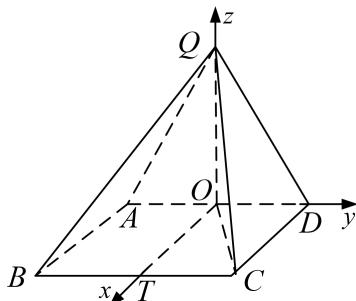

> [!faq]- 《专题11 利用空间向量计算2面角的问题-立体几何（理科）》例题解析
>
> > [!success]- **【答案】** 详见解析
>
> > [!note]- **【解析】**
> > 解析
> > (1)取 AD 的中点为 O，连接 QO，CO.
> >
> > 因为 $QD = QA$ ， $OD = OA$ ，则 $QO \perp AD$ ，而 $AD = 2$ ， $QA = \sqrt{5}$ ，故 $QO = \sqrt{5 - 1} = 2$
> >
> > 在正方形 ABCD 中，因为 AD=2，故 DO=1，故 $CO=\sqrt{5}$ ，
> >
> > 因为 QC=3，故 $QO^{2}+OC^{2}=QC^{2}$ ，故 $\triangle QOC$ 为直角三角形且 $QO\perp OC$ ，
> >
> > 因为 $OC \cap AD = O$ ，故 $QO \perp$ 底面 ABCD。因为 $QO \subset$ 平面 QAD，，故平面 $QAD \perp$ 底面 ABCD。
> >
> > (2)在平面 ABCD 内，过 O 作 OT//CD，交 BC 于 T，则 OT⊥AD，
> >
> > 结合
> > (1)中的 $QO \perp$ 平面 ABCD，故可建如图所示的空间坐标系.
> >
> > 
> >
> > 则 $D(0, 1, 0)$ ， $Q(0, 0, 2)$ ， $B(2, -1, 0)$ ，故 $\overrightarrow{BQ}=(-2, 1, 2)$ ， $\overrightarrow{BD}=(-2, 2, 0)$ .
> >
> > 设平面 QBD 的法向量 $\boldsymbol{n}=(x,y,z)$ ，则 $\left\{\begin{aligned}\boldsymbol{n}\cdot\overrightarrow{BQ}&=0,\\ \boldsymbol{n}\cdot\overrightarrow{BD}&=0,\end{aligned}\right.$ 即 $\left\{\begin{aligned}-2x+y+2z&=0,\\ -2x+2y&=0.\end{aligned}\right.$
> >
> > 不妨设 x=1，可得 $n=(1,1,\frac{1}{2})$ .
> >
> > 而平面 QAD 的法向量为 $m=(1,0,0)$ . 故 $\cos<m$ , $n>=\frac{m\cdot n}{|m||n|}=\frac{1}{1\times\frac{3}{2}}=\frac{2}{3}$ ,
> >
> > 二面角 B-QD-A 的平面角为锐角，故其余弦值为 $\frac{2}{3}$ .
