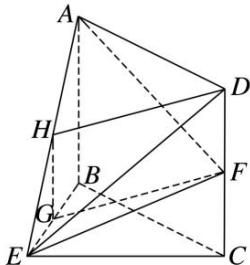
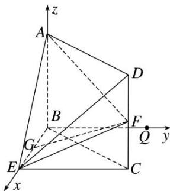
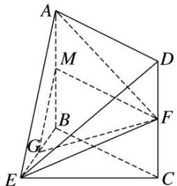

> [!faq]- 《专题11 利用空间向量计算2面角的问题-立体几何（理科）》例题解析
>
> > [!success]- **【答案】** 详见解析
>
> > [!note]- **【分析】**
> > 本题未单列分析。
>
> > [!note]- **【解析】**
> > 解析 方法一
> > (1)如图，取 AE 的中点 H，连接 HG，HD，
> >
> > 
> >
> > 因为 G 是 BE 的中点，所以 $GH \parallel AB$ ，且 $GH = \frac{1}{2} AB$ 。又 F 是 CD 的中点，所以 $DF = \frac{1}{2} CD$ 。
> >
> > 由四边形 ABCD 是矩形，得 $AB \parallel CD$ ，AB = CD，所以 GH // DF，且 GH = DF，
> >
> > 从而四边形 HGFD 是平行四边形，所以 GF//DH.
> >
> > 又 $DH \subset$ 平面 ADE， $GF \not\subset$ 平面 ADE，所以 $GF \parallel$ 平面 ADE.
> >
> > (2)如图，在平面 BEC 内，
> >
> > 
> >
> > 过 B 点作 $BQ \parallel EC$ 。因为 $BE \perp CE$ ，所以 $BQ \perp BE$ 。又因为 $AB \perp$ 平面 BEC ，所以 $AB \perp BE$ ， $AB \perp BQ$ 。
> >
> > 则 $A(0, 0, 2)$ ， $B(0, 0, 0)$ ， $E(2, 0, 0)$ ， $F(2, 2, 1)$ 。因为 $AB \perp$ 平面 BEC，
> >
> > 所以 $\overrightarrow{BA}=(0,0,2)$ 为平面BEC的法向量.
> >
> > 设 $n = (x, y, z)$ 为平面 $AEF$ 的法向量．又 $\overrightarrow{AE} = (2, 0, -2)$ ， $\overrightarrow{AF} = (2, 2, -1)$ ，
> >
> > 由 $\left\{\begin{aligned}\boldsymbol{n}\cdot\overrightarrow{AE}&=0,\\ \boldsymbol{n}\cdot\overrightarrow{AF}&=0,\end{aligned}\right.$ 得 $\left\{\begin{aligned}2x-2z&=0,\\ 2x+2y-z&=0.\end{aligned}\right.$ 取 z=2，得 $\boldsymbol{n}=(2,-1,2)$ .
> >
> > 从而 $|\cos < n, \vec{BA} >| = \frac{|\boldsymbol{n} \cdot \vec{BA}|}{|\boldsymbol{n}||\vec{BA}|} = \frac{4}{2 \times 3} = \frac{2}{3}$ ，所以平面 $AEF$ 与平面 $BEC$ 夹角的余弦值为 $\frac{2}{3}$ .
> >
> > 方法二
> > (1)如图，取 AB 的中点 M，连接 MG，MF.
> >
> > 
> >
> > 由 G 是 BE 的中点，可知 $GM \parallel AE$ 。又 $AE \subset$ 平面 ADE， $GM \not\subset$ 平面 ADE，所以 $GM \parallel$ 平面 ADE。
> >
> > 在矩形 ABCD 中，由 M, F 分别是 AB, CD 的中点得 $MF \parallel AD$ .
> >
> > 又 $AD \subset$ 平面 $ADE$ , $MF \not\subset$ 平面 $ADE$ . 所以 $MF \parallel$ 平面 $ADE$ .
> >
> > 又因为 $GM \cap MF = M$ ， $GM \subset$ 平面 GMF， $MF \subset$ 平面 GMF，所以平面 GMF // 平面 ADE.
> >
> > 因为 $GF \subset$ 平面 GMF，所以 $GF \parallel$ 平面 ADE.
> >
> > (2)同方法一.
