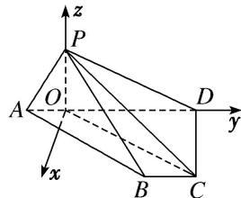

> [!faq]- 《专题11 利用空间向量计算2面角的问题-立体几何（理科）》例题解析
>
> > [!success]- **【答案】** 详见解析
>
> > [!note]- **【解析】**
> > 解析
> > (1) 法一: $\because DC=1, PC=2, PD=\sqrt{AD^{2}-PA^{2}}=\sqrt{3}, \therefore PD^{2}+CD^{2}=PC^{2}$ , 即 $CD\perp PD$ , 又 $CD\perp AD, PD\cap AD=D$ , $\therefore CD\perp$ 平面 $PAD$ , 又 $CD\subset$ 平面 $ABCD$ , $\therefore$ 平面 $PAD\perp$ 平面 $ABCD$ .
> >
> > 
> >
> > 法二：如图，过 P 作 $PO \perp AD$ ，①，垂足为 O，连接 OC，∵ PA = 1， $\angle PAD = 60^{\circ}$ ，∴ $AO = \frac{1}{2}$
> >
> > $PO=\frac{\sqrt{3}}{2}, OC^{2}=OD^{2}+CD^{2}=\frac{13}{4}, OC^{2}+PO^{2}=\frac{13}{4}+\frac{3}{4}=PC^{2}, \therefore PO\perp OC,$ ②，又 $AD\cap OC=O,$ ③
> > ∴结合①②③知 $PO\perp$ 平面ABCD，又 $PO\subset$ 平面PAD，∴平面PAD⊥平面ABCD.
> >
> > (2)以 O 为坐标原点，垂直于 OD 的直线为 x 轴，OD 为 y 轴，OP 为 z 轴建立空间直角坐标系，则 $A\left\{0, -\frac{1}{2}, 0\right\}$ ， $B(1, 1, 0)$ ， $C\left\{1, \frac{3}{2}, 0\right\}$ ， $P\left\{0, 0, \frac{\sqrt{3}}{2}\right\}$ .
> >
> > 设平面 BPC 的法向量为 $\boldsymbol{m}=(x_{1},y_{1},z_{1})$ ，由 $\left\{\begin{aligned}&m\cdot\overrightarrow{BC}=0,\\ &m\cdot\overrightarrow{BP}=0,\end{aligned}\right.$ 得 $x_{1}=\frac{\sqrt{3}}{2}z_{1},y_{1}=0$ ，取 $\boldsymbol{m}=(\sqrt{3},0,2)$ .
> >
> > 设平面 PAB 的法向量为 $\boldsymbol{n}=(x_{2},y_{2},z_{2})$ ，由 $\left\{\begin{aligned}&n\cdot\overrightarrow{AB}=0,\\ &n\cdot\overrightarrow{BP}=0,\end{aligned}\right.$ 得 $x_{2}+\frac{3}{2}y_{2}=0,\quad-x_{2}-y_{2}+\frac{\sqrt{3}}{2}z_{2}=0,$
> >
> > 取 $n=\left(3,-2,\frac{2}{\sqrt{3}}\right)$ ,
> >
> > ∴ $\cos<m,\quad n>=\frac{m\cdot n}{|m|\cdot|n|}=\frac{13\sqrt{301}}{301}$ ，由图形可知二面角 A-PB-C 为钝角，
> >
> > ∴二面角 A-PB-C 的余弦值为 $-\frac{13\sqrt{301}}{301}$ .
