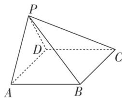

<!-- question-source:start -->
4. 如图，在四棱锥 P-ABCD 中，底面 ABCD 为菱形， $\angle BAD=60^{\circ}$ ， $\angle APD=90^{\circ}$ ，且 AD=PB.

(1)求证：平面 $PAD \perp$ 平面 ABCD;

(2)若 $AD \perp PB$ ，求二面角 $D - PB - C$ 的余弦值.

<!-- question-source:end -->

![[高中/总复习/专题/立体几何/专题11 利用空间向量计算2面角的问题-立体几何（理科）/考点02_棱_圆_锥模型/对点训练/answers/Q00043753A1.md]]
