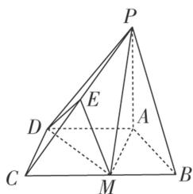

<!-- question-source:start -->
6. 如图，已知四棱锥 $P - ABCD$ ，底面 $ABCD$ 是直角梯形， $AD \parallel BC$ ， $\angle BCD = 90^{\circ}$ ， $PA \perp$ 底面 $ABCD$ ， $\triangle ABM$ 是边长为2的等边三角形， $PA = DM = 2\sqrt{3}$ .

(1)求证：平面 $PAM \perp$ 平面 $PDM$ ;

(2)若 E 为 PC 的中点，求二面角 P-MD-E 的余弦值.

<!-- question-source:end -->

![[高中/总复习/专题/立体几何/专题11 利用空间向量计算2面角的问题-立体几何（理科）/考点02_棱_圆_锥模型/对点训练/answers/Q00043755A1.md]]
