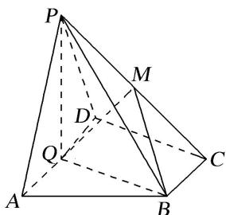

<!-- question-source:start -->
9. 如图, 在四棱锥 $P-ABCD$ 中, 底面 $ABCD$ 为直角梯形, $AD \parallel BC$ , $\angle ADC = 90^\circ$ , 平面 $PAD \perp$ 底面 $ABCD$ ,

Q 为 AD 的中点，M 是棱 PC 上的点，PA = PD = 2， $BC = \frac{1}{2}AD = 1$ ， $CD = \sqrt{3}$ .

(1)求证：平面 $PBC \perp$ 平面 PQB;

(2)当 $PM$ 的长为何值时, 平面 $QMB$ 与平面 $PDC$ 所成的锐二面角的大小为 $60^{\circ}$ ?

<!-- question-source:end -->

![[高中/总复习/专题/立体几何/专题11 利用空间向量计算2面角的问题-立体几何（理科）/考点02_棱_圆_锥模型/对点训练/answers/Q00043758A1.md]]
