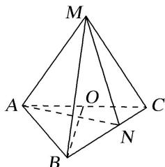
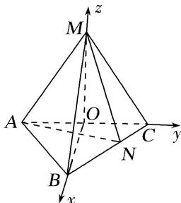

> [!faq]- 《专题11 利用空间向量计算2面角的问题-立体几何（理科）》例题解析
>
> > [!success]- **【答案】** 详见解析
>
> > [!note]- **【分析】**
> > 本题未单列分析。
>
> > [!note]- **【解析】**
> > (1)求证： $BO \perp$ 平面 AMC;
> > (2)求二面角 $N - AM - C$ 的正弦值.
> > 
> > 1. 解析 (1)连接 $OM$ 。在 $\triangle ABC$ 中， $\because AB=BC=2, AC=2\sqrt{2}, \therefore \angle ABC=90^\circ, BO=\sqrt{2}, OB \perp AC.$ 在 $\triangle MAC$ 中， $\because MA=MC=AC=2\sqrt{2}, O$ 为 $AC$ 的中点， $\therefore OM \perp AC$ ，且 $OM=\sqrt{6}$ .
> > 在 $\triangle MOB$ 中， $\because BO=\sqrt{2}, OM=\sqrt{6}, MB=2\sqrt{2}, \therefore BO^2+OM^2=MB^2, \therefore OB \perp OM.$ $\because AC \cap OM=O, AC \subset$ 平面 $AMC, OM \subset$ 平面 $AMC, \therefore OB \perp$ 平面 $AMC.$ (2)由(1)知 $OB, OC, OM$ 两两垂直，以点 $O$ 为坐标原点，分别以 $OB, OC, OM$ 所在直线为 $x$ 轴
> > (2)由(1)知 $OB$ ， $OC$ ， $OM$ 两两垂直，以点 $O$ 为坐标原点，分别以 $OB$ ， $OC$ ， $OM$ 所在直线为 $x$ 轴， $y$ 轴， $z$ 轴建立空间直角坐标系 $O - xyz$ ，如图.
> > 
> > $$
> > \because M A = M B = M C = A C = 2 \sqrt {2}, A B = B C = 2,
> > $$
> > $\therefore A(0, -\sqrt{2}, 0), B(\sqrt{2}, 0, 0), M(0, 0, \sqrt{6}), C(0, \sqrt{2}, 0). \quad \because \overrightarrow{BN} = \frac{2}{3}\overrightarrow{BC}, \quad \therefore N\left[\frac{\sqrt{2}}{3}, \frac{2\sqrt{2}}{3}, 0\right],$ $\therefore \overrightarrow{AN} = \left[\frac{\sqrt{2}}{3}, \frac{5\sqrt{2}}{3}, 0\right], \overrightarrow{AM} = (0, \sqrt{2}, \sqrt{6}), \overrightarrow{OB} = (\sqrt{2}, 0, 0).$ 设平面 $MAN$ 的法向量为 $n = (x, y, z)$ ，则 $\left\{ \begin{array}{l} \overrightarrow{AN} \cdot n = \left[\frac{\sqrt{2}}{3}, \frac{5\sqrt{2}}{3}, 0\right]. \\ \overrightarrow{AM} \cdot n = (0, \sqrt{2}, \sqrt{6}) \cdot (x, y, z) = \sqrt{2}y + \sqrt{6}z = 0. \end{array} \right.$ 令 $y = \sqrt{3}$ ，则 $z = -1, x = -5\sqrt{3}$ ，得 $n = (-5\sqrt{3}, \sqrt{3}, -1)$ . $\because BO \perp$ 平面 $AMC, \therefore \overrightarrow{OB} = (\sqrt{2}, 0, 0)$ 为平面 $AMC$ 的一个法向量. $\therefore n = (-5\sqrt{3}, \sqrt{3}, -1)$ 与 $\overrightarrow{OB} = (\sqrt{2}, 0, 0)$ 所成角的余弦值 $\cos < n, \overrightarrow{OB} > = \frac{-5\sqrt{6}}{\sqrt{79} \times \sqrt{2}} = \frac{-5\sqrt{3}}{\sqrt{79}}.$ $\therefore$ 所求二面角的正弦值为 $\sqrt{1 - \left[\frac{-5\sqrt{3}}{\sqrt{79}}\right]^{2}} = \frac{2}{\sqrt{79}} = \frac{2\sqrt{79}}{79}.$
