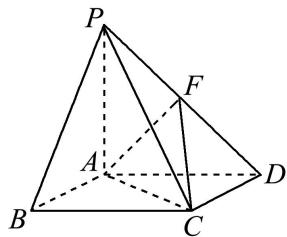
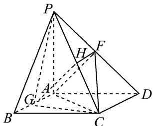
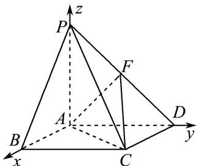
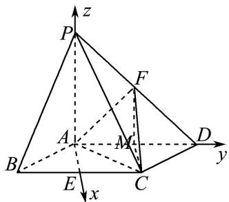
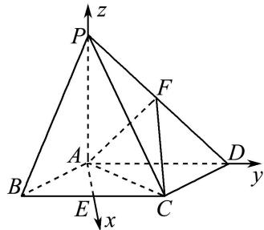

> [!faq]- 《专题11 利用空间向量计算2面角的问题-立体几何（理科）》例题解析
>
> > [!success]- **【答案】** 详见解析
>
> > [!note]- **【分析】**
> > 本题未单列分析。
>
> > [!note]- **【解析】**
> > (1)在线面 $AB$ 上是否存在一点 $G$ , 使得 $AF \parallel$ 平面 $PCG$ ? 若存在, 指出 $G$ 在 $AB$ 上的位置并给以证明; 若不存在, 请说明理由.
> > (2)若\_\_\_\_，求二面角 F-AC-D 的余弦值.
> > 
> > 10. 解析 (1)在线段 $AB$ 上存在点 $G$ , 使得 $AF \parallel$ 平面 $PCG$ , 且 $G$ 为 $AB$ 的中点.
> > 证明如下：设 PC 的中点为 H，连接 FH，GH，如图，易证四边形 AGHF 为平行四边形，则 AF // GH.
> > 
> > 又 $GH \subset$ 平面 PCG， $AF \nsubseteq$ 平面 PGC，所以 $AF \parallel$ 平面 PGC.
> > (2)选择①.
> > 因为 $PA \perp$ 平面 ABCD，所以 $PA \perp AB$ ， $PA \perp AD$ 。由题意可知，AB，AD，AP 两两垂直，
> > 故以 A 为坐标原点， $\overrightarrow{AB}$ ， $\overrightarrow{AD}$ ， $\overrightarrow{AP}$ 的方向分别为 x, y, z 轴的正方向建立如图所示的空间直角坐标系.
> > 
> > 因为 PA=AB=2，所以 $A(0,0,0)$ ， $C(2,2,0)$ ， $D(0,2,0)$ ， $P(0,0,2)$ ， $F(0,1,1)$ ，
> > 所以 $\overrightarrow{AF}=(0,1,1)$ ， $\overrightarrow{CF}=(-2,-1,1)$ .
> > 设平面 FAC 的法向量为 $\boldsymbol{u}=(x,y,z)$ ，则 $\left\{\begin{aligned}\boldsymbol{u}\cdot\overrightarrow{AF}&=0,\\ \boldsymbol{u}\cdot\overrightarrow{CF}&=0,\end{aligned}\right.$ 即 $\left\{\begin{aligned}y+z&=0,\\ -2x-y+z&=0.\end{aligned}\right.$
> > 令 y=1，则 x=-1，z=-1，则 $u=(-1,1,-1)$ .
> > 易知平面 ACD 的一个法向量为 $v=(0,0,2)$ ,
> > 设二面角 $F - AC - D$ 的平面角为 $\theta$ ，则 $\cos \theta = \frac{|\boldsymbol{u} \cdot \boldsymbol{v}|}{|\boldsymbol{u}||\boldsymbol{v}|} = \frac{\sqrt{3}}{3}$ ，即二面角 $F - AC - D$ 的余弦值为 $\frac{\sqrt{3}}{3}$ . 选择②.
> > 设 BC 中点 E，连接 AE，取 AD 的中点 M，连接 FM，CM，则 $FM \parallel PA$ ，且 FM = 1.
> > 因为 $PA \perp$ 平面 ABCD，所以 $FM \perp$ 平面 ABCD，FC 与平面 ABCD 所成的角为 $\angle FCM$ ，
> > 故 $\angle FCM = \frac{\pi}{6}$ . 在直角三角形 $FCM$ 中, $CM = \sqrt{3}$ . 又因为 $CM = AE$ , 所以 $AE^2 + BE^2 = AB^2$ ,
> > 所以 $BC \perp AE$ ，所以 AE，AD，AP 两两垂直。
> > 故以 A 为坐标原点， $\overrightarrow{AE}$ ， $\overrightarrow{AD}$ ， $\overrightarrow{AP}$ 的方向分别为 x, y, z 轴的正方向建立如图所示的空间直角坐标系.
> > 
> > 因为 PA=AB=2，所以 $A(0,0,0)$ ， $C(\sqrt{3},1,0)$ ， $D(0,2,0)$ ， $P(0,0,2)$ ， $F(0,1,1)$ ，
> > 所以 $\overrightarrow{AF}=(0,1,1)$ ， $\overrightarrow{CF}=(-\sqrt{3},0,1)$ .
> > 设平面 $FAC$ 的法向量为 $\pmb{u} = (x, y, z)$ ，则 $\left\{ \begin{array}{l} \pmb{u} \cdot \overrightarrow{AF} = 0, \\ \pmb{u} \cdot \overrightarrow{CF} = 0, \end{array} \right.$ 即 $\left\{ \begin{array}{l} y + z = 0, \\ -\sqrt{3} x + z = 0. \end{array} \right.$
> > 令 $x=\sqrt{3}$ ，则 y=-3，z=3，则 $u=(\sqrt{3}, -3, 3)$ .
> > 易知平面 ACD 的一个法向量为 $\nu=(0,0,2)$ .
> > 设二面角 $F - AC - D$ 的平面角为 $\theta$ ，则 $\cos \theta = \frac{|\boldsymbol{u} \cdot \boldsymbol{v}|}{|\boldsymbol{u}||\boldsymbol{v}|} = \frac{\sqrt{21}}{7}$ ，即二面角 $F - AC - D$ 的余弦值为 $\frac{\sqrt{21}}{7}$ . 选择③.
> > 因为 $PA \perp$ 平面 ABCD，所以 $PA \perp BC$ 。取 BC 中点 E，连接 AE。
> > 因为底面 ABCD 是菱形， $\angle ABC=\frac{\pi}{3}$ ，所以 $\triangle ABC$ 是正三角形.
> > 又 E 是 BC 的中点，所以 $BC \perp AE$ ，所以 AE，AD，AP 两两垂直.
> > 故以 A 为坐标原点， $\overrightarrow{AE}$ ， $\overrightarrow{AD}$ ， $\overrightarrow{AP}$ 的方向分别为 x, y, z 轴的正方向建立如图所示的空间直角坐标系.
> > 
> > 因为 PA=AB=2，所以 $A(0,0,0)$ ， $C(\sqrt{3},1,0)$ ， $D(0,2,0)$ ， $P(0,0,2)$ ， $F(0,1,1)$ ，
> > 所以 $\overrightarrow{AF}=(0,1,1)$ ， $\overrightarrow{CF}=(-\sqrt{3},0,1)$ .
> > 设平面 FAC 的法向量为 $\boldsymbol{u}=(x,y,z)$ ，则 $\left\{\begin{aligned}\boldsymbol{u}\cdot\overrightarrow{AF}=0,\\ \boldsymbol{u}\cdot\overrightarrow{CF}=0,\end{aligned}\right.$ 即 $\left\{\begin{aligned}y+z=0,\\ -\sqrt{3}x+z=0.\end{aligned}\right.$
> > 令 $x=\sqrt{3}$ ，则 y=-3，z=3，则 $u=(\sqrt{3}, -3, 3)$ .
> > 易知平面 ACD 的一个法向量为 $\nu=(0,0,2)$ ,
> > 设二面角 $F - AC - D$ 的平面角为 $\theta$ ，则 $\cos \theta = \frac{|u \cdot v|}{|u||v|} = \frac{\sqrt{21}}{7}$ ，即二面角 $F - AC - D$ 的余弦值为 $\frac{\sqrt{21}}{7}$ .
