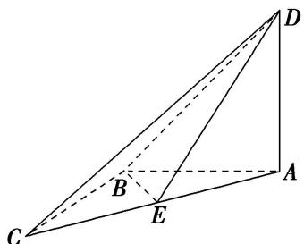
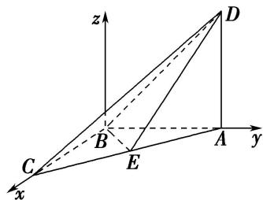

> [!faq]- 《专题11 利用空间向量计算2面角的问题-立体几何（理科）》例题解析
>
> > [!success]- **【答案】** 详见解析
>
> > [!note]- **【分析】**
> > 本题未单列分析。
>
> > [!note]- **【解析】**
> > (1)证明： $BC\perp$ 平面ABD；
> > (2)设 E 为棱 AC 的中点，当四面体 ABCD 的体积取得最大值时，求二面角 C-BD-E 的余弦值.
> > 
> > 2. 解析
> > (1) 因为 $AD \perp AB$ , 平面 $ABD \perp$ 平面 $ABC$ , 平面 $ABD \cap$ 平面 $ABC = AB$ , $AD \subset$ 平面 $ABD$ , 所以 $AD \perp$ 平面 $ABC$ , 因为 $BC \subset$ 平面 $ABC$ , 所以 $AD \perp BC$ .
> > 因为 $AB=BC=\frac{\sqrt{2}}{2}AC$ ，所以 $AB^{2}+BC^{2}=AC^{2}$ ，所以 $AB\perp BC$ ，
> > 因为 $AD \cap AB = A$ ，所以 $BC \perp$ 平面 ABD.
> > 
> > (2)设 $AD = x(0 < x < 4)$ ，则 $AB = BC = 4 - x$ ，四面体ABCD的体积
> > $$
> > V = f (x) = \frac {1}{3} x \times \frac {1}{2} (4 - x) ^ {2} = \frac {1}{6} \left(x ^ {3} - 8 x ^ {2} + 1 6 x\right) (0 <   x <   4).
> > $$
> > $$
> > f (x) = \frac {1}{6} \left(3 x ^ {2} - 1 6 x + 1 6\right) = \frac {1}{6} (x - 4) (3 x - 4),
> > $$
> > 当 $0 < x < \frac{4}{3}$ 时， $f(x) > 0$ ， $V = f(x)$ 单调递增；当 $\frac{4}{3} < x < 4$ 时， $f'(x) < 0$ ， $V = f(x)$ 单调递减.
> > 故当 $AD = x = \frac{4}{3}$ 时，四面体ABCD的体积取得最大值.
> > 以 B 为坐标原点，建立空间直角坐标系 B-xyz，
> > 则 $B(0, 0, 0)$ ， $A\left(0, \frac{8}{3}, 0\right)$ ， $C\left(\frac{8}{3}, 0, 0\right)$ ， $D\left(0, \frac{8}{3}, \frac{4}{3}\right)$ ， $E\left(\frac{4}{3}, \frac{4}{3}, 0\right)$ .
> > 设平面 BCD 的法向量为 $\boldsymbol{n}=(x,y,z)$ ，则 $\left\{\begin{aligned}\boldsymbol{n}\cdot\overrightarrow{BC}&=0,\\ \boldsymbol{n}\cdot\overrightarrow{BD}&=0,\end{aligned}\right.$ ，即 $\left\{\begin{aligned}\frac{8}{3}x&=0,\\ \frac{8}{3}y+\frac{4}{3}z&=0,\end{aligned}\right.$
> > 令 z = -2，得 $n = (0, 1, -2)$ ,
> > 同理可得平面 BDE 的一个法向量为 $m=(1,-1,2)$ ,
> > 则 $\cos < m, n > = \frac{m \cdot n}{|m||n|} = \frac{-5}{\sqrt{5} \times \sqrt{6}} = -\frac{\sqrt{30}}{6}$ .
> > 由图可知，二面角 C-BD-E 为锐角，故二面角 C-BD-E 的余弦值为 $\frac{\sqrt{30}}{6}$ .
