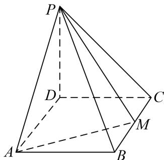
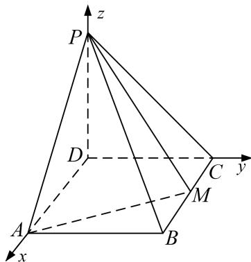

> [!faq]- 《专题11 利用空间向量计算2面角的问题-立体几何（理科）》例题解析
>
> > [!success]- **【答案】** 详见解析
>
> > [!note]- **【分析】**
> > 本题未单列分析。
>
> > [!note]- **【解析】**
> > (1)求 $BC$ ;
> > (2)求二面角 A-PM-B 的正弦值.
> > 
> > 3. 解析
> > (1)连结 $BD$ ，因为 $PD \perp$ 底面 $ABCD$ ，且 $AM \subset$ 平面 $ABCD$ ，则 $AM \perp PD$ ，又 $AM \perp PB$ ， $PB \cap PD = P$ ， $PB$ ， $PD \subset$ 平面 $PBD$ ，所以 $AM \perp$ 平面 $PBD$ ，又 $BD \subset$ 平面 $PBD$ ，则 $AM \perp BD$ ，所以 $\angle ABD + \angle DAM = 90^\circ$ ，又 $\angle DAM + \angle MAB = 90^\circ$ ，则有 $\angle ADB = \angle MAB$ ，所以 Rt $\triangle DAB \sim$ Rt $\triangle ABM$ ，则 $\frac{AD}{AB} = \frac{BA}{BM}$ ，所以 $\frac{1}{2}BC^2 = 1$ ，解得 $BC = \sqrt{2}$ .
> > 
> > (2)因为 $DA, DC, DP$ 两两垂直，故以点 $D$ 位坐标原点建立空间直角坐标系如图所示，则 $A(\sqrt{2}, 0, 0), B(\sqrt{2}, 1, 0), M(\frac{\sqrt{2}}{2}, 1, 0), P(0, 0, 1)$ . 所以 $\overrightarrow{AP} = (-\sqrt{2}, 0, 1), \overrightarrow{AM} = (-\frac{\sqrt{2}}{2}, 1, 0), \overrightarrow{BM} = (-\frac{\sqrt{2}}{2}, 0, 0)$ . $\overrightarrow{BP} = (-\sqrt{2}, -1, 1)$ 设平面 $AMP$ 的法向量为 $n = (x, y, z)$ ，则有 $\left\{ \begin{array}{l} n \cdot \overrightarrow{AP} = 0, \\ n \cdot \overrightarrow{AM} = 0, \end{array} \right.$ ，即 $\left\{ \begin{array}{l} -\sqrt{2} x + z = 0, \\ -\frac{\sqrt{2}}{2} x + y = 0. \end{array} \right.$ 令 $x = \sqrt{2}$ ，则 $y = 1, z = 2$ ，故 $n = (\sqrt{2}, 1, 2)$ ，设平面 $BMP$ 的法向量为 $m = (p, q, r)$ ，则有 $\left\{ \begin{array}{l} m \cdot \overrightarrow{BM} = 0, \\ m \cdot \overrightarrow{BP} = 0, \end{array} \right.$ ，即 $\left\{ \begin{array}{l} -\frac{\sqrt{2}}{2} p = 0, \\ -\sqrt{2} p - q + r = 0. \end{array} \right.$ 令 $q = 1$ ，则 $r = 1$ ，故 $m = (0, 1, 1)$ ，所以 $\cos < n, m > = \frac{n \cdot m}{|n||m|} = \frac{3}{\sqrt{7} \times \sqrt{2}} = \frac{3\sqrt{14}}{14}$ .
> > 设二面角 $A - PM - B$ 的平面角为 $\alpha$ ，则 $\sin \alpha = \frac{\sqrt{70}}{14}$
> > 所以二面角 A-PM-B 的正弦值为 $\frac{\sqrt{70}}{14}$ .
