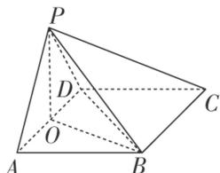
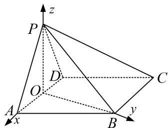

> [!faq]- 《专题11 利用空间向量计算2面角的问题-立体几何（理科）》例题解析
>
> > [!success]- **【答案】** D
>
> > [!note]- **【解析】**
> > 解析
> > (1)如图, 取 ${AD}$ 的中点 $O$ ,连接 ${OP},{OB},{BD}$ ,
> >
> > 因为底面 ABCD 为菱形， $\angle BAD=60^{\circ}$ ，所以 AD=AB=BD。
> >
> > 因为 O 为 AD 的中点，所以 OB ⊥ AD.
> >
> > 在 $\triangle APD$ 中， $\angle APD=90^{\circ}$ ，O为AD的中点，所以 $PO=\frac{1}{2}AD=AO$ .
> >
> > 设 $AD = PB = 2a$ ，则 $OB = \sqrt{3} a$ ， $PO = OA = a$
> >
> > 因为 $PO^{2}+OB^{2}=a^{2}+3a^{2}=4a^{2}=PB^{2}$ ，所以 $OP\perp OB$ .
> >
> > 因为 $OP \cap AD = O$ ， $OP \subset$ 平面 PAD， $AD \subset$ 平面 PAD，所以 OB ⊥ 平面 PAD.
> >
> > 因为 $OB \subset$ 平面 ABCD，所以平面 PAD⊥平面 ABCD.
> >
> > 
> >
> > (2)因为 $AD \perp PB$ ， $AD \perp OB$ ， $OB \cap PB = B$ ， $PB \subset$ 平面 POB， $OB \subset$ 平面 POB，
> >
> > 所以 $AD \perp$ 平面 POB．所以 $PO \perp AD$ ．由
> > (1)得 $PO \perp OB$ ， $AD \perp OB$ ，
> >
> > 所以 OA, OB, OP 所在的直线两两互相垂直.
> >
> > 以 O 为坐标原点，OA，OB，OP 所在直线分别为 x 轴、y 轴、z 轴建立如图所示的空间直角坐标系.
> >
> > 
> >
> > 设 AD=2，则 $A(1,0,0)$ ， $D(-1,0,0)$ ， $B(0,\sqrt{3},0)$ ， $P(0,0,1)$ ，
> >
> > $$
> > \vec {P D} = (- 1, 0, - 1), \vec {P B} = (0, \sqrt {3}, - 1), \vec {B C} = \vec {A D} = (- 2, 0, 0)
> > $$
> >
> > 设平面 PBD 的法向量为 $\boldsymbol{n}=(x_{1},y_{1},z_{1})$ ，则 $\left\{\begin{aligned}\boldsymbol{n}\cdot\overrightarrow{PD}&=-x_{1}-z_{1}=0,\\ \boldsymbol{n}\cdot\overrightarrow{PB}&=\sqrt{3}y_{1}-z_{1}=0,\end{aligned}\right.$ 令 $y_{1}=1$ ，则 $x_{1}=-\sqrt{3}$ ， $z_{1}=\sqrt{3}$ ，所以 $\boldsymbol{n}=(-\sqrt{3},1,\sqrt{3})$ .
> >
> > 设平面 PBC 的法向量为 $\boldsymbol{m}=(x_{2},y_{2},z_{2})$ ，则 $\left\{\begin{aligned}\boldsymbol{m}\cdot\vec{B}\vec{C}&=-2x_{2}=0,\\ \boldsymbol{m}\cdot\vec{P}\vec{B}&=\sqrt{3}y_{2}-z_{2}=0,\end{aligned}\right.$
> >
> > $$
> > x _ {2} = 0, \quad z _ {2} = \sqrt {3}
> > $$
> >
> > $$
> > \boldsymbol {m} = (0, 1, \sqrt {3})
> > $$
> >
> > 设二面角 D-PB-C 的大小为 $\theta$ ，由于 $\theta$ 为锐角，所以 $\cos\theta=|\cos<m,\quad n>|=\frac{4}{2\times\sqrt{7}}=\frac{2\sqrt{7}}{7}$ .
> >
> > 所以二面角 D-PB-C 的余弦值为 $\frac{2\sqrt{7}}{7}$ .
