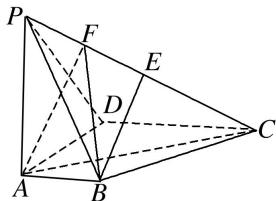
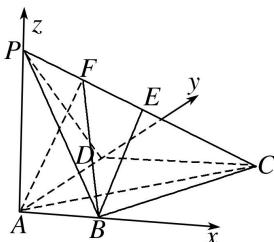

> [!faq]- 《专题11 利用空间向量计算2面角的问题-立体几何（理科）》例题解析
>
> > [!success]- **【答案】** 详见解析
>
> > [!note]- **【分析】**
> > 本题未单列分析。
>
> > [!note]- **【解析】**
> > (1)求证： $BE \perp DC;$
> > (2)若 $F$ 为棱 $PC$ 上一点，满足 $BF \perp AC$ ，求平面 $FAB$ 与平面 $ABP$ 夹角的余弦值.
> > 
> > 5. 解析
> > (1)依题意, 以点 $A$ 为坐标原点建立空间直角坐标系(如图),
> > 可得 $A(0, 0, 0)$ ， $B(1, 0, 0)$ ， $C(2, 2, 0)$ ， $D(0, 2, 0)$ ， $P(0, 0, 2)$ .
> > 由 E 为棱 PC 的中点，得 $E(1, 1, 1)$ ，所以 $\overrightarrow{BE} = (0, 1, 1)$ ， $\overrightarrow{DC} = (2, 0, 0)$ ，故 $\overrightarrow{BE} \cdot \overrightarrow{DC} = 0$ ，所以 $BE \perp DC$ .
> > 
> > (2) $\overrightarrow{BC}=(1,2,0),\quad\overrightarrow{CP}=(-2,-2,2),\quad\overrightarrow{AC}=(2,2,0),\quad\overrightarrow{AB}=(1,0,0).$
> > 由点 F 在棱 PC 上，设 $\overrightarrow{CF} = \lambda \overrightarrow{CP} (0 \leqslant \lambda \leqslant 1)$ ,
> > 故 $\overrightarrow{BF} = \overrightarrow{BC} +\overrightarrow{CF} = \overrightarrow{BC} +\lambda \overrightarrow{CP} = (1 - 2\lambda ,2 - 2\lambda ,2\lambda)$ .由 $BF\bot AC$ ，得 $\overrightarrow{BF}\cdot \overrightarrow{AC} = 0$
> > 因此 $2(1-2\lambda)+2(2-2\lambda)=0$ ，解得 $\lambda=\frac{3}{4}$ ，即 $\overrightarrow{BF}=\left(-\frac{1}{2},\frac{1}{2},\frac{3}{2}\right)$ .
> > 设 $\boldsymbol{n}_{1}=(x,y,z)$ 为平面 FAB 的法向量，则 $\left\{\begin{aligned}\boldsymbol{n}_{1}\cdot\overrightarrow{AB}&=0,\\ \boldsymbol{n}_{1}\cdot\overrightarrow{BF}&=0\end{aligned}\right.$ 即 $\left\{\begin{aligned}x&=0,\\ -\frac{1}{2}x+\frac{1}{2}y+\frac{3}{2}z&=0.\end{aligned}\right.$
> > 不妨令 z=1，可得 $n_{1}=(0,-3,1)$ 为平面 FAB 的一个法向量.
> > 易知向量 $n_{2}=(0,1,0)$ 为平面 ABP 的一个法向量，
> > $$
> > \cos <   \boldsymbol {n} _ {1}, \quad \boldsymbol {n} _ {2} > = \frac {\boldsymbol {n} _ {1} \cdot \boldsymbol {n} _ {2}}{| \boldsymbol {n} _ {1} | \cdot | \boldsymbol {n} _ {2} |} = \frac {- 3}{\sqrt {1 0} \times 1} = - \frac {3 \sqrt {1 0}}{1 0}.
> > $$
> > 所以平面 FAB 与平面 ABP 夹角的余弦值为 $\frac{3\sqrt{10}}{10}$ .
