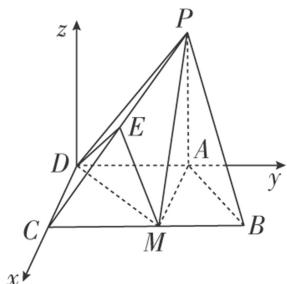

> [!faq]- 《专题11 利用空间向量计算2面角的问题-立体几何（理科）》例题解析
>
> > [!success]- **【答案】** 详见解析
>
> > [!note]- **【分析】**
> > 本题未单列分析。
>
> > [!note]- **【解析】**
> > (1)求证：平面 $PAM \perp$ 平面 $PDM$ ;
> > (2)若 E 为 PC 的中点，求二面角 P-MD-E 的余弦值.
> > 
> > 6. 解析
> > (1)∵△ABM是边长为2的等边三角形，底面ABCD是直角梯形，∴ $CD=\sqrt{3}$ ,
> > $$
> > D M = 2 \sqrt {3}, \therefore C M = 3, \therefore A D = 3 + 1 = 4, \therefore A D ^ {2} = D M ^ {2} + A M ^ {2}, \therefore D M \perp A M.
> > $$
> > 又 $PA \perp$ 底面 ABCD，∴ $DM \perp PA$ ，又 $AM \cap PA = A$ ，∴ $DM \perp$ 平面 PAM，
> > ∵DM⊂平面PDM，∴平面PAM⊥平面PDM.
> > (2)以 D 为坐标原点，DC 所在直线为 x 轴，DA 所在直线为 y 轴，过 D 且与 PA 平行的直线为 z 轴，建立空间直角坐标系 Dxyz，
> > 
> > 则 $D(0, 0, 0)$ ， $C(\sqrt{3}, 0, 0)$ ， $M(\sqrt{3}, 3, 0)$ ， $P(0, 4, 2\sqrt{3})$
> > $$
> > \vec {D M} = (\sqrt {3}, 3, 0), \vec {D P} = (0, 4, 2 \sqrt {3}),
> > $$
> > 设平面 PMD 的法向量为 $\boldsymbol{n}_{1}=(x_{1},y_{1},z_{1})$ ，则 $\left\{\begin{aligned}\sqrt{3}x_{1}+3y_{1}&=0,\\4y_{1}+2\sqrt{3}z_{1}&=0,\end{aligned}\right.$ 取 $x_{1}=3,\therefore n_{1}=(3,-\sqrt{3},2)$ .
> > ∵E为PC的中点，则 $E\left(\frac{\sqrt{3}}{2},2,\sqrt{3}\right)$ ， $\overrightarrow{DE}=\left(\frac{\sqrt{3}}{2},2,\sqrt{3}\right)$
> > 设平面 MDE 的法向量为 $\boldsymbol{n}_{2}=(x_{2},y_{2},z_{2})$ ，则 $\left\{\begin{aligned}\sqrt{3}x_{2}+3y_{2}&=0,\\ \frac{\sqrt{3}}{2}x_{2}+2y_{2}+\sqrt{3}z_{2}&=0,\end{aligned}\right.$ 取 $x_{2}=3,\therefore n_{2}=\left(3,-\sqrt{3},\frac{1}{2}\right)$ .
> > 设二面角 P-MD-E 的平面角为 $\theta$ ，由 $\cos\theta=\frac{n_{1}\cdot n_{2}}{|n_{1}||n_{2}|}=\frac{13}{14}$ ,
> > ∴二面角 P-MD-E 的余弦值为 $\frac{13}{14}$ .
