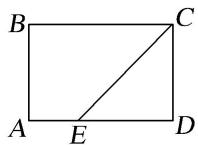
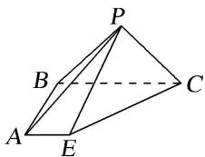
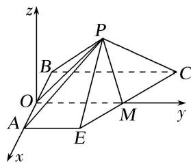

> [!faq]- 《专题11 利用空间向量计算2面角的问题-立体几何（理科）》例题解析
>
> > [!success]- **【答案】** 详见解析
>
> > [!note]- **【分析】**
> > 本题未单列分析。
>
> > [!note]- **【解析】**
> > (1)求证：平面 $PCE \perp$ 平面 ABCE;
> > (2)求二面角 $B - PA - E$ 的余弦值.
> > 
> > 
> > 7. 解析
> > (1)依题意得: $PE = PC = 2$ , 分别取线段 $AB$ , $CE$ 的中点 $O$ , $M$ , 连接 $\triangle POM$ 的三边(如图).
> > 
> > 则 $PM \perp CE$ ，由 $PA = PB$ ，得 $PO \perp AB$ ，①
> > 又 $OM$ 为梯形 $ABCE$ 的中位线， $\therefore OM \parallel BC$ ，由 $BC \perp AB$ ，得 $OM \perp AB$ ，②
> > 又 $PO \cap OM = O$ ，从而 $AB \perp$ 平面 POM，则 $AB \perp PM$ .
> > 在平面 ABCE 中，AB 与 CE 相交．∴PM⊥平面 ABCE，故平面 PCE⊥平面 ABCE.
> > (2)过点 O 作 PM 平行线为 z 轴，分别以 OA, OM 为 x, y 轴建立空间直角坐标系.
> > $A(1, 0, 0), B(-1, 0, 0), E(1, 1, 0), P(0, 2, \sqrt{2}),$
> > $\therefore \overrightarrow{PA} = (1, -2, -\sqrt{2}), \overrightarrow{BA} = (2, 0, 0), \overrightarrow{AE} = (0, 1, 0),$
> > 设 $\boldsymbol{n}=(x,y,z)$ 为平面 PAB 的法向量，则 $\left\{\begin{aligned}\overrightarrow{PA}\cdot\boldsymbol{n}&=0,\\ \overrightarrow{BA}\cdot\boldsymbol{n}&=0,\end{aligned}\right.$ 即 $\left\{\begin{aligned}x-2y-\sqrt{2}z&=0,\\ 2x&=0,\end{aligned}\right.$ 令 y=1，得 $\boldsymbol{n}=(0,1,-\sqrt{2})$ ，同理：平面 PAE 的法向量 $\boldsymbol{m}=(\sqrt{2},0,1)$ ,
> > $\therefore \cos < m, n > = \frac{m \cdot n}{|m||n|} = -\frac{\sqrt{2}}{3}$ ，根据图形知二面角 $B - PA - E$ 为钝角，
> > ∴二面角 B-PA-E 的余弦值为 $-\frac{\sqrt{2}}{3}$ .
