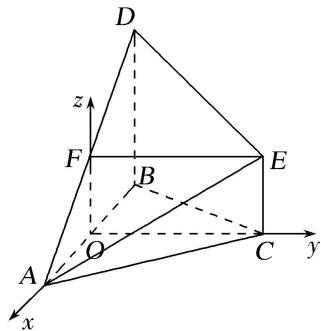

> [!faq]- 《专题11 利用空间向量计算2面角的问题-立体几何（理科）》例题解析
>
> > [!success]- **【答案】** 详见解析
>
> > [!note]- **【分析】**
> > 本题未单列分析。
>
> > [!note]- **【解析】**
> > (1)求证： $EF \parallel$ 平面 ABC;
> > (2)求二面角 $C - AE - D$ 的余弦值.
> > 
> > 8. 解析
> > (1) 取 AB 的中点为 O，连接 OC，OF，如图.
> > 
> > ∵O，F分别为AB，AD的中点，∴OF∥BD且BD=2OF.
> > 又 $CE \parallel BD$ 且 $BD = 2CE$ , $\therefore CE \parallel OF$ 且 $CE = OF$ ,
> > ∴OF∥EC，则四边形OCEF为平行四边形，∴EF//OC.
> > 又 OC⊂平面 ABC，EF∉平面 ABC，∴ EF∥平面 ABC.
> > (2) $\because \triangle ABC$ 为等边三角形，O 为 AB 的中点， $\therefore OC \perp AB$ .
> > ∵平面 $ABC \perp$ 平面 ABD，平面 $ABC \cap$ 平面 ABD = AB， $BD \perp AB$ ， $BD \subset$ 平面 ABD，
> > ∴BD⊥平面ABC．又OF∥BD，∴OF⊥平面ABC.
> > 以 O 为坐标原点，分别以 OA, OC, OF 所在的直线为 x 轴，y 轴，z 轴，建立如图所示的空间直角坐标系．不妨令正三角形 ABC 的边长为 2，
> > $$
> > O (0, 0, 0), A (1, 0, 0), C (0, \sqrt {3}, 0), E (0, \sqrt {3}, 1), D (- 1, 0, 2),
> > $$
> > $$
> > \therefore \overrightarrow {A C} = (- 1, \sqrt {3}, 0), \overrightarrow {A E} = (- 1, \sqrt {3}, 1), \overrightarrow {A D} = (- 2, 0, 2).
> > $$
> > 设平面 AEC 的法向量为 $\boldsymbol{m}=(x_{1},y_{1},z_{1})$ ，则 $\left\{\begin{aligned}\overrightarrow{AC}\cdot\boldsymbol{m}&=-x_{1}+\sqrt{3}y_{1}=0,\\ \overrightarrow{AE}\cdot\boldsymbol{m}&=-x_{1}+\sqrt{3}y_{1}+z_{1}=0.\end{aligned}\right.$
> > 不妨令 $y_{1}=\sqrt{3}$ ，则 $m=(3,\sqrt{3},0)$ .
> > 设平面 AED 的法向量为 $\boldsymbol{n}=(x_{2},y_{2},z_{2})$ ，则 $\left\{\begin{aligned}\overrightarrow{AD}\cdot\boldsymbol{n}&=-2x_{2}+2z_{2}=0,\\ \overrightarrow{AE}\cdot\boldsymbol{n}&=-x_{2}+\sqrt{3}y_{2}+z_{2}=0.\end{aligned}\right.$
> > 令 $z_{2}=1$ ，得 $n=(1,0,1)$ .
> > $\therefore \cos < m, n > = \frac{3}{2\sqrt{3} \times \sqrt{2}} = \frac{\sqrt{6}}{4}$ . 由图易知二面角 $C - AE - D$ 为钝角，
> > ∴二面角 C-AE-D 的余弦值为 $-\frac{\sqrt{6}}{4}$ .
