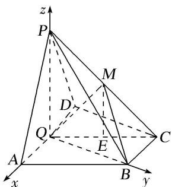

> [!faq]- 《专题11 利用空间向量计算2面角的问题-立体几何（理科）》例题解析
>
> > [!success]- **【答案】** 详见解析
>
> > [!note]- **【解析】**
> > 解析
> > (1) $\because AD \parallel BC, Q$ 为 $AD$ 的中点, $BC = \frac{1}{2} AD$ , $\therefore BC \parallel QD, BC = QD$ ,
> >
> > ∴四边形 BCDQ 为平行四边形，∴BQ//CD. ∵∠ADC=90°，∴BC⊥BQ.
> >
> > $$
> > \because P A = P D, A Q = Q D, \therefore P Q \perp A D.
> > $$
> >
> > 又∵平面 PAD⊥平面 ABCD，平面 PAD∩平面 ABCD=AD，
> >
> > ∴PQ⊥平面ABCD，∴PQ⊥BC. 又∵PQ∩BQ=Q，∴BC⊥平面PQB.
> >
> > ∵BC⊂平面PBC，∴平面PBC⊥平面PQB.
> >
> > (2)由
> > (1)可知 $PQ \perp$ 平面 ABCD．如图，以 Q 为原点，分别以 QA, QB, QP 所在直线为 x 轴、y 轴、z 轴，建立空间直角坐标系，则 $Q(0, 0, 0)$ , $D(-1, 0, 0)$ , $P(0, 0, \sqrt{3})$ , $B(0, \sqrt{3}, 0)$ , $C(-1, \sqrt{3}, 0)$ ,
> >
> > 
> >
> > $$
> > \therefore \overrightarrow {Q B} = (0, \sqrt {3}, 0), \overrightarrow {D C} = (0, \sqrt {3}, 0), \overrightarrow {D P} = (1, 0, \sqrt {3}), \overrightarrow {P C} = (- 1, \sqrt {3}, - \sqrt {3}).
> > $$
> >
> > 设 $\overrightarrow{PM}=\lambda\overrightarrow{PC}$ ，则 $\overrightarrow{PM}=(-\lambda,\sqrt{3}\lambda,-\sqrt{3}\lambda)$ ，且 $0\leq\lambda\leq1$ ，得 $M(-\lambda,\sqrt{3}\lambda,\sqrt{3}-\sqrt{3}\lambda)$
> >
> > $$
> > \therefore \overrightarrow {Q M} = (- \lambda , \sqrt {3} \lambda , \sqrt {3} (1 - \lambda))
> > $$
> >
> > 设平面 MBQ 的法向量为 $\boldsymbol{m}=(x,y,z)$ ，则 $\left\{\begin{aligned}\overrightarrow{QM}\cdot\boldsymbol{m}&=0,\\ \overrightarrow{QB}\cdot\boldsymbol{m}&=0,\end{aligned}\right.$ 即 $\left\{\begin{aligned}-\lambda x+\sqrt{3}\lambda y+\sqrt{3}(1-\lambda)z&=0,\\ \sqrt{3}y&=0.\end{aligned}\right.$
> >
> > 令 $x=\sqrt{3}$ ，则 y=0， $z=\frac{\lambda}{1-\lambda}$
> >
> > ∴平面 MBQ 的一个法向量为 $m=\left(\sqrt{3},\quad0,\quad\frac{\lambda}{1-\lambda}\right)$ .
> >
> > 设平面 PDC 的法向量为 $\boldsymbol{n}=(x', y', z')$ ，则 $\left\{\begin{aligned}\overrightarrow{DC}\cdot\boldsymbol{n}&=0,\\ \overrightarrow{DP}\cdot\boldsymbol{n}&=0,\end{aligned}\right.$ 即 $\left\{\begin{aligned}\sqrt{3}y'=0,\\ x'+\sqrt{3}z'=0.\end{aligned}\right.$
> >
> > 令 $x'=3$ ，则 $y'=0,\quad z'=-\sqrt{3}$ ，∴平面 PDC 的一个法向量为 $n=(3,0,-\sqrt{3})$ .
> >
> > ∴平面 QMB 与平面 PDC 所成的锐二面角的大小为 $60^{\circ}$ ,
> >
> > $$
> > \therefore \cos 6 0 ^ {\circ} = \frac {| \boldsymbol {n} \cdot \boldsymbol {m} |}{| \boldsymbol {n} | | \boldsymbol {m} |} = \frac {\left| 3 \sqrt {3} - \sqrt {3} \cdot \frac {\lambda}{1 - \lambda} \right|}{\sqrt {1 2} \cdot \sqrt {3 + \left(\frac {\lambda}{1 - \lambda}\right) 2}} = \frac {1}{2}, \quad \therefore \lambda = \frac {1}{2}. \quad \therefore P M = \frac {1}{2} P C = \frac {\sqrt {7}}{2}.
> > $$
