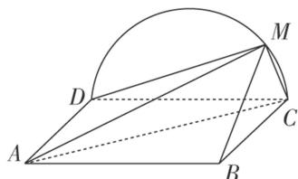

<!-- question-source:start -->
[例 1] (2018·全国III)如图, 边长为 2 的正方形 ABCD 所在的平面与半圆弧 $\widehat{CD}$ 所在平面垂直, M 是 $\widehat{CD}$ 上异于 C, D 的点.

(1)证明：平面 $AMD \perp$ 平面 $BMC$ ;

(2)当三棱锥 M-ABC 体积最大时，求面 MAB 与面 MCD 所成二面角的正弦值.

<!-- question-source:end -->

![[高中/总复习/专题/立体几何/专题11 利用空间向量计算2面角的问题-立体几何（理科）/考点03_不规则几何体模型/例题/answers/Q00043760A1.md]]
