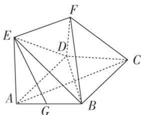

<!-- question-source:start -->
[例 2] 如图，四边形 ABCD 是菱形， $EA \perp$ 平面 ABCD， $EF \parallel AC$ ， $CF \parallel$ 平面 BDE，G 是 AB 的中点.

(1)求证： $EG \parallel$ 平面 BCF;

(2)若 $AE = AB$ ， $\angle BAD = 60^{\circ}$ ，求二面角 $A - BE - D$ 的余弦值.

<!-- question-source:end -->

![[高中/总复习/专题/立体几何/专题11 利用空间向量计算2面角的问题-立体几何（理科）/考点03_不规则几何体模型/例题/answers/Q00043761A1.md]]
