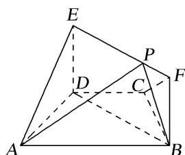

<!-- question-source:start -->
[例 4] 如图，在梯形 ABCD 中， $AB \parallel CD$ ，AD = DC = CB = 1， $\angle BCD = \frac{2\pi}{3}$ ，四边形 BFED 为矩形，平面 $BFED \perp$ 平面 ABCD，BF = 1.

(1)求证： $AD \perp$ 平面 BFED;

(2)点 P 在线段 EF 上运动，设平面 PAB 与平面 ADE 所成锐二面角为 $\theta$ ，试求 $\theta$ 的最小值.

<!-- question-source:end -->

![[高中/总复习/专题/立体几何/专题11 利用空间向量计算2面角的问题-立体几何（理科）/考点03_不规则几何体模型/例题/answers/Q00043763A1.md]]
