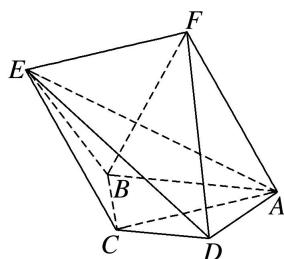
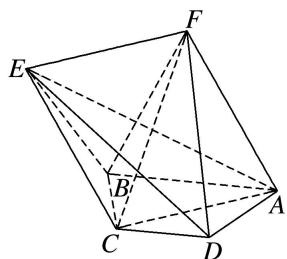
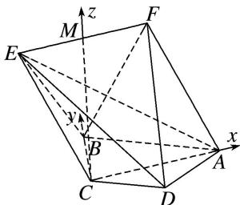

> [!faq]- 《专题11 利用空间向量计算2面角的问题-立体几何（理科）》例题解析
>
> > [!success]- **【答案】** 详见解析
>
> > [!note]- **【分析】**
> > 本题未单列分析。
>
> > [!note]- **【解析】**
> > (1)求证： $BF \perp AE;$
> > (2)求二面角 B-EF-D 的平面角的正切值.
> > 
> > 解析 (1)依题意, 在等腰梯形 $ABCD$ 中, $AC = 2\sqrt{3}$ , $AB = 4$ , $\because BC = 2$ , $\therefore AC^2 + BC^2 = AB^2$ , 即 $BC \perp AC$ , 又 $\because$ 平面 $ACEF \perp$ 平面 $ABCD$ , 平面 $ACEF \cap$ 平面 $ABCD = AC$ , $BC \subset$ 平面 $ABCD$ ,
> > ∴BC⊥平面ACEF，而AE⊂平面ACEF，∴AE⊥BC，
> > 连接 CF，∵四边形 ACEF 为菱形，∴AE⊥FC，
> > 
> > 又∵ $BC\cap CF=C$ ，BC， $CF\subset$ 平面BCF，∴AE⊥平面BCF，∵BF⊂平面BCF，∴BF⊥AE.
> > (2)取 EF 的中点 M，连接 MC，
> > 
> > ∵四边形 ACEF 是菱形，且 $\angle CAF=60^{\circ}$ ，∴由平面几何易知 $MC \perp AC$ ，
> > 又∵平面 $ACEF \perp$ 平面 ABCD，平面 $ACEF \cap$ 平面 ABCD = AC，CM ⊂ 平面 ACEF，∴ $MC \perp$ 平面 ABCD.
> > 以 CA, CB, CM 所在直线分别为 x, y, z 轴建立空间直角坐标系，各点的坐标依次为 $C(0,0,0)$ ， $A(2\sqrt{3},0,0)$ ， $B(0,2,0)$ ， $D(\sqrt{3},-1,0)$ ， $E(-\sqrt{3},0,3)$ ， $F(\sqrt{3},0,3)$ ，
> > 设平面 BEF 和平面 DEF 的一个法向量分别为 $\boldsymbol{n}_{1}=(a_{1}, b_{1}, c_{1})$ ， $\boldsymbol{n}_{2}=(a_{2}, b_{2}, c_{2})$ ，
> > $\because \overrightarrow{BF} = (\sqrt{3}, -2, 3), \overrightarrow{EF} = (2\sqrt{3}, 0, 0),$
> > $\therefore \left\{ \begin{array}{l} \overrightarrow{BF} \cdot \boldsymbol{n}_{1} = 0, \\ \overrightarrow{EF} \cdot \boldsymbol{n}_{1} = 0, \end{array} \right.$ 即 $\left\{ \begin{array}{l} \sqrt{3} a_{1} - 2b_{1} + 3c_{1} = 0, \\ 2\sqrt{3} a_{1} = 0, \end{array} \right.$ 即 $\left\{ \begin{array}{l} a_{1} = 0, \\ 2b_{1} = 3c_{1}, \end{array} \right.$ 不妨令 $b_{1} = 3$ ，则 $\boldsymbol{n}_{1} = (0, 3, 2)$ ，
> > 同理可求得 $n_{2}=(0,3,-1)$ ,
> > 设二面角 B-EF-D 的大小为 $\theta$ ，由图易知 $\theta$ 为锐角，
> > $$
> > \therefore \cos \theta = | \cos <   \boldsymbol {n} _ {1}, \quad \boldsymbol {n} _ {2} > | = \frac {| \boldsymbol {n} _ {1} \cdot \boldsymbol {n} _ {2} |}{| \boldsymbol {n} _ {1} | \cdot | \boldsymbol {n} _ {2} |} = \frac {7}{\sqrt {1 3 0}},
> > $$
> > 故二面角 B-EF-D 的平面角的正切值为 $\frac{9}{7}$ .
