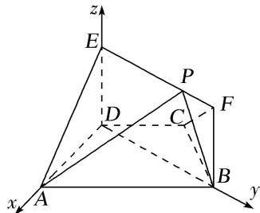

> [!faq]- 《专题11 利用空间向量计算2面角的问题-立体几何（理科）》例题解析
>
> > [!success]- **【答案】** 详见解析
>
> > [!note]- **【分析】**
> > 本题未单列分析。
>
> > [!note]- **【解析】**
> > (1)求证： $AD \perp$ 平面 BFED;
> > (2)点 P 在线段 EF 上运动，设平面 PAB 与平面 ADE 所成锐二面角为 $\theta$ ，试求 $\theta$ 的最小值.
> > 
> > 解析 (1)在梯形ABCD中，∵AB∥CD，AD=DC=CB=1，∠BCD= $\frac{2\pi}{3}$ ,
> > $$
> > \therefore A B = 2, \quad \therefore B D ^ {2} = A B ^ {2} + A D ^ {2} - 2 A B \cdot A D \cdot \cos \frac {\pi}{3} = 3. \quad \therefore A B ^ {2} = A D ^ {2} + B D ^ {2}, \quad \therefore A D \perp B D.
> > $$
> > ∵平面 BFED⊥平面 ABCD，平面 BFED∩平面 ABCD=BD，DE⊂平面 BFED，DE⊥DB，
> > ∴DE⊥平面ABCD，∴DE⊥AD，又 $DE\cap BD=D$ ，∴AD⊥平面BFED.
> > (2)由(1)可建立以点 D 为坐标原点，分别以直线 DA, DB, DE 为 x 轴，y 轴，z 轴的空间直角坐标系，如图所示.
> > 
> > 令 $EP=\lambda(0\leq\lambda\leq\sqrt{3})$ ，则 $D(0,0,0,)$ ， $A(1,0,0)$ ， $B(0,\sqrt{3},0)$ ， $P(0,\lambda,1)$
> > $$
> > \therefore \overrightarrow {A B} = (- 1, \sqrt {3}, 0), \overrightarrow {B P} = (0, \lambda - \sqrt {3}, 1).
> > $$
> > 设 $\boldsymbol{n}_{1}=(x,y,z)$ 为平面 PAB 的一个法向量，由 $\left\{\begin{aligned}\boldsymbol{n}_{1}\cdot\overrightarrow{AB}&=0,\\ \boldsymbol{n}_{1}\cdot\overrightarrow{BP}&=0,\end{aligned}\right.$ 得 $\left\{\begin{aligned}-x+\sqrt{3}y&=0,\\ (\lambda-\sqrt{3})y+z&=0,\end{aligned}\right.$
> > 取 $y = 1$ ，得 $\pmb{n}_{1} = (\sqrt{3},1,\sqrt{3} -\lambda),$
> > $\because n_{2}=(0,1,0)$ 是平面 ADE 的一个法向量，
> > $$
> > \therefore \cos \theta = \frac {\left| \boldsymbol {n} _ {1} \cdot \boldsymbol {n} _ {2} \right|}{\left| \boldsymbol {n} _ {1} \right| \left| \boldsymbol {n} _ {2} \right|} = \frac {1}{\sqrt {3 + 1 + (\sqrt {3} - \lambda) ^ {2}} \times 1} = \frac {1}{\sqrt {(\lambda - \sqrt {3}) ^ {2} + 4}}.
> > $$
> > $\because 0\leq\lambda\leq\sqrt{3},\quad\therefore$ 当 $\lambda=\sqrt{3}$ 时， $\cos\theta$ 有最大值 $\frac{1}{2}$ ，又 $\because\theta$ 为锐角， $\therefore\theta$ 的最小值为 $\frac{\pi}{3}$ .
> > ## 【对点训练】
