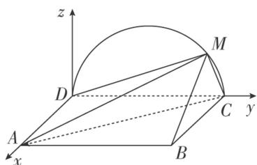

> [!faq]- 《专题11 利用空间向量计算2面角的问题-立体几何（理科）》例题解析
>
> > [!success]- **【答案】** 详见解析
>
> > [!note]- **【分析】**
> > 本题未单列分析。
>
> > [!note]- **【解析】**
> > 解析
> > (1)由题设知，平面 $CMD \perp$ 平面 ABCD，交线为 CD.
> >
> > 因为 $BC \perp CD$ ， $BC \subset$ 平面 ABCD，所以 $BC \perp$ 平面 CMD，故 $BC \perp DM$ .
> >
> > 因为 M 为 $\widehat{CD}$ 上异于 C, D 的点，且 DC 为直径，所以 $DM \perp CM$ .
> >
> > 又 $BC \cap CM = C$ ，所以 $DM \perp$ 平面 BMC。而 $DM \subset$ 平面 AMD，故平面 $AMD \perp$ 平面 BMC。
> >
> > (2)以 D 为坐标原点， $\overrightarrow{DA}$ 的方向为 x 轴正方向， $\overrightarrow{DC}$ 的方向为 y 轴正方向，建立如图所示的空间直角坐标系 Dxyz.
> >
> > 
> >
> > 当三棱锥 M-ABC 体积最大时，M 为 $\widehat{CD}$ 的中点.
> >
> > 由题设得 $D(0, 0, 0)$ ， $A(2, 0, 0)$ ， $B(2, 2, 0)$ ， $C(0, 2, 0)$ ， $M(0, 1, 1)$ ，
> >
> > $\vec{A}M = (-2, 1, 1)$ , $\vec{A}B = (0, 2, 0)$ , $\vec{DA} = (2, 0, 0)$ .
> >
> > 设 $n=(x,y,z)$ 是平面 MAB 的法向量，则 $\left\{\begin{aligned}n\cdot\overrightarrow{AM}&=0,\\ n\cdot\overrightarrow{AB}&=0,\end{aligned}\right.$ 即 $\left\{\begin{aligned}-2x+y+z&=0,\\ 2y&=0.\end{aligned}\right.$ 可取 $n=(1,0,2)$ .
> >
> > $\vec{DA}$ 是平面 $MCD$ 的一个法向量，因此， $\cos < n$ ， $\vec{DA} > = \frac{n\cdot\vec{DA}}{|n||\vec{DA}|} = \frac{\sqrt{5}}{5},\sin < n,\vec{DA} > = \frac{2\sqrt{5}}{5},$
> >
> > 所以面 MAB 与面 MCD 所成二面角的正弦值是 $\frac{2\sqrt{5}}{5}$ .
